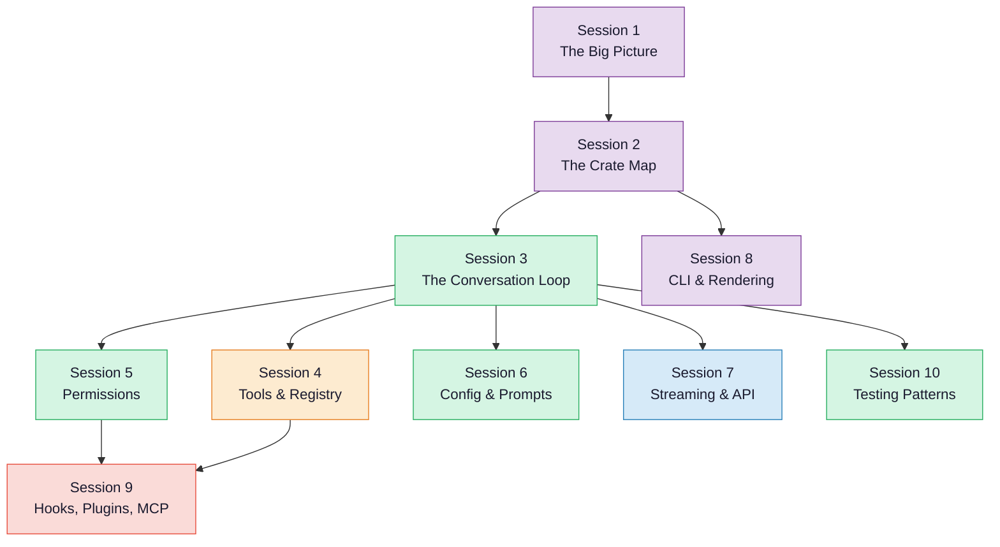

# Claw Code Architecture Guide

Welcome to the architecture guide for **Claw Code** — a Rust-based AI agent CLI harness. This guide is designed for anyone curious about how the project works, even if you're just starting out with programming.

Each **session** below is a self-contained chapter. You can read them in order for the full picture, or jump to a specific topic. Sessions build on each other, so if something feels confusing, check the earlier sessions first.

## Quick Jump

<ArchitectureHero />

## Learning Path

The diagram below shows the recommended reading order. Arrows mean "read this first." Click any node to jump to that session.

## Sessions

| # | Session | What You'll Learn |
|---|---------|-------------------|
| 1 | [The Big Picture](session-01-big-picture.md) | What Claw Code does, how a user session works, where the code lives |
| 2 | [The Crate Map](session-02-crate-map.md) | The 9 Rust crates, what each one does, how they depend on each other |
| 3 | [The Conversation Loop](session-03-conversation-loop.md) | The "agentic loop" — the heart of the system that talks to the AI and runs tools |
| 4 | [Tools & Registry](session-04-tools-and-registry.md) | How the 14 built-in tools are defined, registered, and executed |
| 5 | [The Permission System](session-05-permissions.md) | How the system decides which tools the AI is allowed to use |
| 6 | [Config & Prompts](session-06-config-and-prompts.md) | The 5-level config hierarchy and how the system prompt is assembled |
| 7 | [Streaming & API](session-07-streaming.md) | How Claw Code talks to the AI API and processes real-time streaming responses |
| 8 | [CLI & Rendering](session-08-cli-and-rendering.md) | The REPL loop, terminal rendering, input handling, and slash commands |
| 9 | [Hooks, Plugins, MCP](session-09-hooks-plugins-mcp.md) | Extension points: hooks, the plugin system, and Model Context Protocol |
| 10 | [Testing Patterns](session-10-testing-patterns.md) | How the trait-based design makes testing easy with mock components |

## Color Legend

Throughout the diagrams in this guide, colors represent different parts of the codebase:

| Color | Crate / Area |
|-------|-------------|
| Purple | `claw-cli` — the main binary and terminal UI |
| Green | `runtime` — the core engine |
| Orange | `tools` — tool definitions and execution |
| Blue | `api` — HTTP client and streaming |
| Red | Extension points (hooks, plugins, MCP) |

## Prerequisites

No Rust knowledge is required to read Sessions 1-5. Starting from Session 6, we occasionally show real Rust code, but every snippet is explained in plain English right after.

If you want to follow along in the source code, the Rust workspace lives at `rust/` in the repository root.
