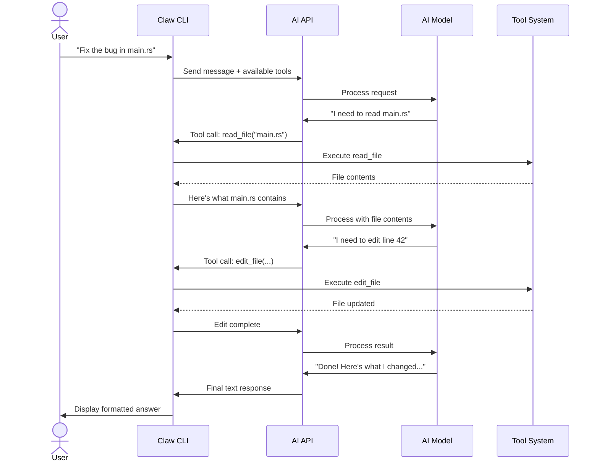
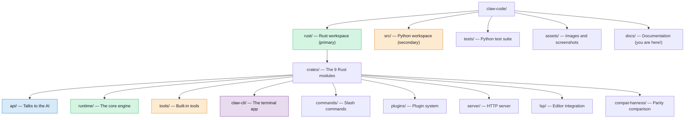

# Session 1: The Big Picture

**What You'll Learn**
- What Claw Code actually does and why it exists
- How a typical user session works, step by step
- Why there are two implementations (Rust and Python)
- Where everything lives on disk

## What Is an AI Agent CLI Harness?

Let's break that phrase down:

- **CLI** = Command-Line Interface. It's a program you use by typing text into a terminal, not by clicking buttons.
- **AI Agent** = An AI that doesn't just chat — it can *do things*. It can read your files, search the web, run commands, and write code.
- **Harness** = The wiring that connects the AI to all those capabilities. Think of it as a switchboard operator.

**Imagine this:** You walk into a hotel and tell the concierge, "I need a restaurant reservation, a taxi, and my laundry picked up." The concierge doesn't do all of those things personally — they pick up the phone, call the restaurant, call the taxi company, and call housekeeping. They coordinate everything and report back to you.

Claw Code is that concierge. You type a request. Claw Code sends it to an AI model (like Claude). The AI decides what tools it needs (read a file, run a command, search the web). Claw Code runs those tools and feeds the results back to the AI. The AI uses those results to give you a final answer.

<Annotation type="analogy" title="Why not just chat?">

Regular chatbots are like talking to someone who can only give advice: "You should change line 42." An **agent** is like having someone who can actually go change line 42 for you, test it, and tell you if it worked. That's the difference between a chatbot and an AI agent.

</Annotation>

## A Typical Session, Step by Step

Here's what happens when you use Claw Code:

Notice the loop: the AI keeps asking for tools until it has everything it needs. This is called the **agentic loop** — we'll explore it in detail in [Session 3](session-03-conversation-loop.md).

<Annotation type="detail" title="How many loops is typical?">

In practice, most requests need 1-5 iterations. A simple question ("What does this function do?") might need just 1 tool call (read the file). A complex task ("Refactor this module and add tests") could need 10+ iterations as the AI reads, plans, edits, and verifies.

</Annotation>

### The key players

| Player | What it does |
|--------|-------------|
| **You** | Type a request in natural language |
| **Claw CLI** | The program running in your terminal — coordinates everything |
| **AI API** | The network connection to the AI service (like Anthropic's API) |
| **AI Model** | The brain — decides what to do and what tools to use |
| **Tool System** | The toolbox — reads files, runs commands, searches, etc. |

---

## Two Implementations: Rust and Python

Claw Code has two versions of the codebase:

### Rust (the primary one)

The Rust implementation is the main, actively developed version. It lives in the `rust/` directory and contains about 20,000 lines of code split across 9 modules called "crates" (more on that in [Session 2](session-02-crate-map.md)).

Why Rust? It's fast, memory-safe, and great for building reliable command-line tools.

<Annotation type="info" title="What is memory safety?">

In languages like C, a bug in your code can accidentally read or write random parts of your computer's memory — leading to crashes or security holes. Rust prevents this at compile time: if your code could have a memory bug, the compiler won't let you build it. This is especially important for a tool that runs shell commands on your computer.

</Annotation>

### Python (the secondary one)

The Python implementation in `src/` was the first version — a quick proof-of-concept. It's now mostly used for **parity auditing**: comparing what the Python version can do vs. what the Rust version can do, to make sure nothing gets left behind during the rewrite.

**For the rest of this guide, we'll focus on the Rust implementation** since that's where all the active development happens.

---

## Where Everything Lives

Here's the repository layout:

### Important files at the root

| File | Purpose |
|------|---------|
| `README.md` | Project overview, backstory, quickstart |
| `CLAW.md` | Instructions for the AI when it works on this repo (like a `.env` but for AI behavior) |
| `PARITY.md` | Detailed comparison of Rust vs. original TypeScript feature coverage |

**Key Takeaways**
- Claw Code is a **switchboard** between you and an AI — it handles tool calls, permissions, and output rendering
- The AI doesn't just chat; it can **read files, run commands, search the web, and edit code**
- The main implementation is in **Rust** (~20K lines across 9 crates)
- The **agentic loop** (AI asks for tools → Claw runs them → feeds results back) is the core concept

<SessionNav
  :current="1"
  :next="{ text: 'Session 2: The Crate Map', link: '/architecture/session-02-crate-map' }"
/>
