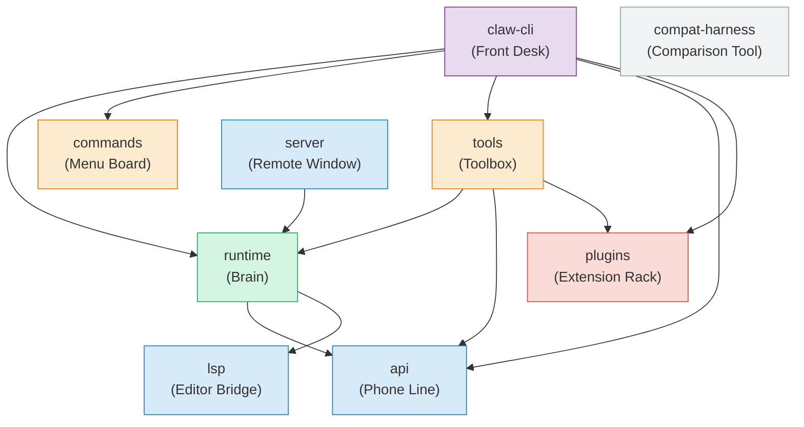
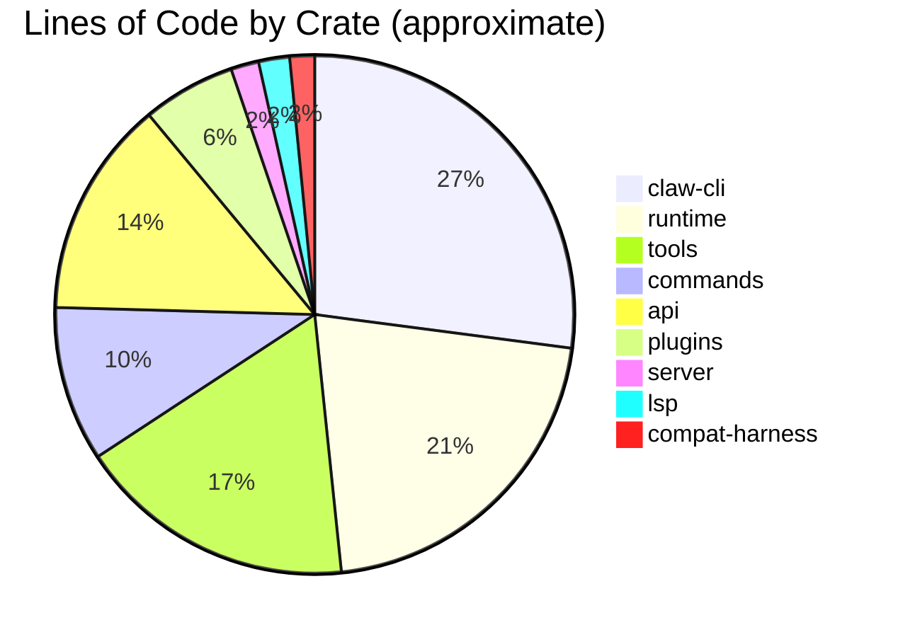

<script setup>
import Annotation from '../.vitepress/theme/Annotation.vue'
import SessionNav from '../.vitepress/theme/SessionNav.vue'
</script>

# Session 2: The Crate Map

<div class="what-youll-learn">

**What You'll Learn**
- What a Rust "crate" is and why the project is split into 9 of them
- What each crate is responsible for
- How the crates depend on each other
- Where the most complex code lives

</div>

---

## What Is a Crate?

In Rust, a **crate** is a self-contained module of code — like a department in a company. Each department has its own job, its own staff, and clear boundaries with other departments. The accounting department doesn't handle customer support, and the marketing department doesn't write payroll checks.

Claw Code is organized as a **Rust workspace** — a collection of crates that are built together but kept separate for clarity. The workspace is defined in `rust/Cargo.toml`, and all 9 crates live inside `rust/crates/`.

---

## The 9 Crates

Here's each crate, what it does, and an everyday analogy:

### 1. `claw-cli` — The Front Desk

**Analogy:** The receptionist who greets you, takes your request, and hands you the result.

This is the **main binary** — the program you actually run when you type `claw` in your terminal. It handles:
- Reading your input (with Vim-mode support and command history)
- Displaying the AI's response with pretty markdown formatting and syntax highlighting
- Parsing command-line arguments (`--model`, `--permission-mode`, etc.)
- Running the REPL (Read-Eval-Print Loop) — the interactive session
- Showing a spinner while the AI thinks

**Key files:** `main.rs` (4,786 lines), `input.rs`, `render.rs`

### 2. `runtime` — The Brain

**Analogy:** The manager who coordinates everything behind the scenes.

This is the **core engine**. It contains the agentic loop ([Session 3](session-03-conversation-loop.md)), configuration loading, session persistence, permissions, hooks, and more. If `claw-cli` is the face of the operation, `runtime` is the brains.

**Key modules:**
- `conversation.rs` — The agentic loop
- `config.rs` — Configuration file discovery and merging
- `session.rs` — Saving/loading conversation history
- `permissions.rs` — Tool authorization
- `hooks.rs` — Pre/post tool-use hooks
- `prompt.rs` — System prompt assembly
- `usage.rs` — Token and cost tracking
- `oauth.rs` — Authentication

<Annotation type="detail" title="What are generics?">
You'll see Rust code like `ConversationRuntime<C, T>` in the runtime crate. Generics are like a form letter with blanks: "Dear _____, thank you for your _____." The letter's structure stays the same no matter what you fill in. The `<C, T>` are those blanks — they let you write one piece of code that works with any type that fits the right "shape" (called a trait). This means `ConversationRuntime` doesn't need to know whether it's talking to a real API or a test mock.
</Annotation>

### 3. `api` — The Phone Line

**Analogy:** The telephone that connects you to the AI on the other end.

This crate handles all communication with the AI service. It knows how to:
- Send HTTP requests to the Anthropic API (or OpenAI-compatible endpoints)
- Parse SSE (Server-Sent Events) streams — receiving the AI's response word by word
- Handle authentication (API keys, OAuth tokens)
- Retry failed requests with exponential backoff

**Key files:** `client.rs`, `sse.rs`, `types.rs`, `providers/claw_provider.rs`

### 4. `tools` — The Toolbox

**Analogy:** A belt of tools that the AI can reach for — a file reader, a search engine, a command runner, etc.

This crate defines and manages the 14 built-in tools the AI can use. Each tool has a name, a description, a JSON Schema for its inputs, and a required permission level. The `GlobalToolRegistry` keeps track of all available tools (built-in + plugins).

**Key file:** `lib.rs` (4,469 lines)

### 5. `commands` — The Menu Board

**Analogy:** The menu of special actions you (the human) can trigger with slash commands like `/help` or `/status`.

This crate defines 27 slash commands that you type directly (not the AI). Things like `/compact` to shrink conversation history, `/model` to switch AI models, `/diff` to see git changes.

**Key file:** `lib.rs` (2,511 lines)

### 6. `plugins` — The Extension Rack

**Analogy:** Extra gadgets you can plug into the system to add new tools or behaviors.

This crate defines how external plugins work — their manifest format, how they provide additional tools, and how plugin hooks integrate with the system. Currently **scaffolded** (the structure exists but not all runtime behavior works yet).

**Key file:** `lib.rs`

### 7. `server` — The Remote Window

**Analogy:** A window where other programs can talk to Claw Code over the network.

An Axum-based HTTP server that exposes Claw Code's functionality via API endpoints. You can create sessions, send messages, and stream responses over SSE — useful for building UIs on top of Claw Code.

**Key file:** `lib.rs`

### 8. `lsp` — The Editor Bridge

**Analogy:** A translator that lets Claw Code understand your code editor's language.

LSP (Language Server Protocol) is a standard that code editors use. This crate lets Claw Code talk to language servers to get things like "go to definition" and "find references" — enriching the AI's understanding of your code.

**Key file:** `client.rs`

### 9. `compat-harness` — The Comparison Tool

**Analogy:** A checklist that compares the Rust version against the original to make sure nothing's missing.

This crate reads the upstream TypeScript source (when available) and extracts lists of tools, commands, and bootstrap phases. It's used for parity auditing — making sure the Rust rewrite covers everything the original did.

**Key file:** `lib.rs`

<Annotation type="analogy" title="Why split into crates?">
Imagine a restaurant where one person does everything: takes orders, cooks, washes dishes, manages the books, and greets customers. If that person gets sick, everything stops. Now imagine a restaurant with specialized staff — a host, a chef, a dishwasher, and an accountant. Each person can be trained, replaced, or improved independently. Crates work the same way: each one has a focused job, can be tested in isolation, and can be changed without breaking unrelated parts of the system.
</Annotation>

---

## How the Crates Depend on Each Other

Not every crate talks to every other crate. Here's the dependency graph:



**Reading the arrows:** An arrow from A to B means "A uses B." For example, `claw-cli` uses `runtime`, `commands`, `tools`, `api`, and `plugins`.

### The Main Chain

The most important dependency chain is:

```
claw-cli → runtime → api
```

This is the backbone: the CLI uses the runtime engine, which uses the API client to talk to the AI.

---

## Where Does the Complexity Live?

Not all crates are equal in size. Here's a rough breakdown:



The top three — `claw-cli`, `runtime`, and `tools` — contain about 70% of all the code. This makes sense: the terminal UI, the core engine, and the tool system are where most of the action happens.

---

## Quick Reference Table

| Crate | Analogy | Key Responsibility | Main File(s) |
|-------|---------|-------------------|--------------|
| `claw-cli` | Front Desk | REPL, input, rendering, arg parsing | `main.rs`, `input.rs`, `render.rs` |
| `runtime` | Brain | Agentic loop, config, sessions, permissions | `conversation.rs`, `config.rs`, `session.rs` |
| `api` | Phone Line | HTTP client, SSE streaming, auth | `client.rs`, `sse.rs`, `types.rs` |
| `tools` | Toolbox | 14 built-in tools, tool registry | `lib.rs` |
| `commands` | Menu Board | 27 slash commands | `lib.rs` |
| `plugins` | Extension Rack | Plugin manifest, plugin tools | `lib.rs` |
| `server` | Remote Window | HTTP/SSE server | `lib.rs` |
| `lsp` | Editor Bridge | Language server client | `client.rs` |
| `compat-harness` | Comparison Tool | TS manifest extraction | `lib.rs` |

---

<div class="key-takeaways">

**Key Takeaways**
- The project is split into **9 crates** (modules) for separation of concerns
- The **backbone** is `claw-cli` → `runtime` → `api`
- `claw-cli` handles the UI, `runtime` handles the logic, `api` handles the network
- `tools` provides the 14 capabilities the AI can use
- Most complexity lives in `claw-cli`, `runtime`, and `tools` (70% of all code)

</div>

<SessionNav
  :current="2"
  :prev="{ text: 'Session 1: The Big Picture', link: '/architecture/session-01-big-picture' }"
  :next="{ text: 'Session 3: Conversation Loop', link: '/architecture/session-03-conversation-loop' }"
/>
