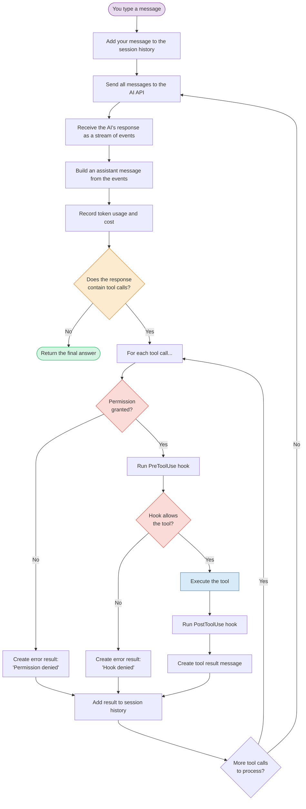
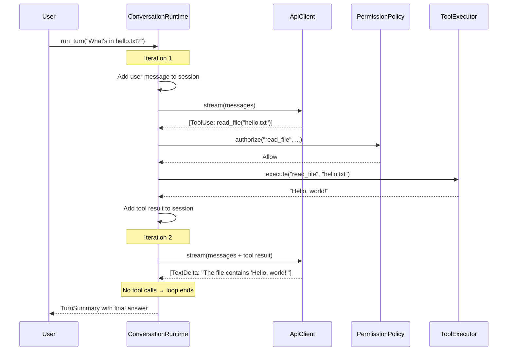
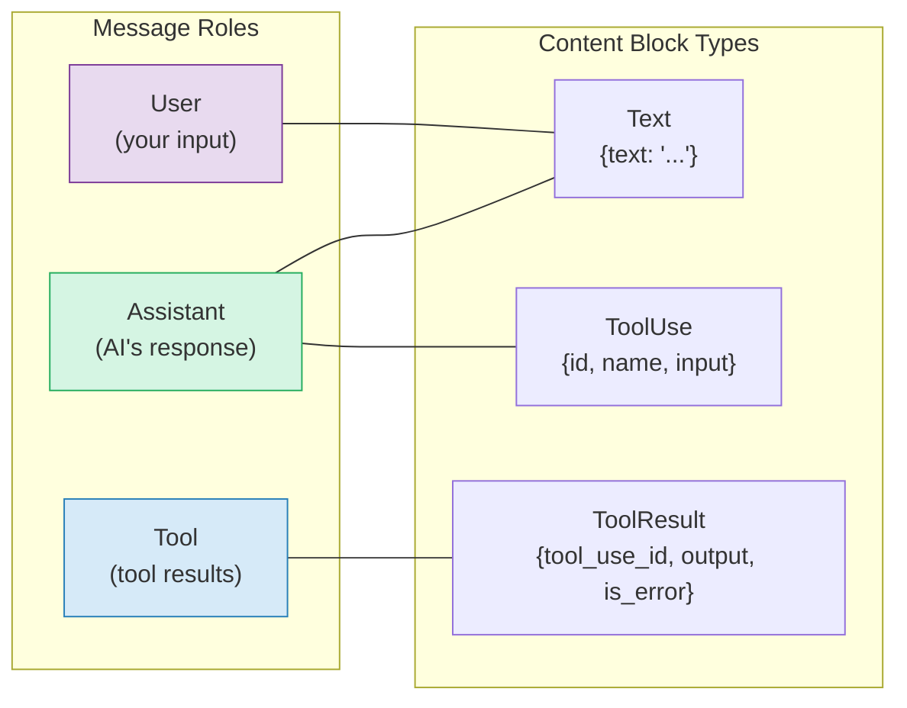

<script setup>
import Annotation from '../.vitepress/theme/Annotation.vue'
import SessionNav from '../.vitepress/theme/SessionNav.vue'
import WhyItWorks from '../.vitepress/theme/WhyItWorks.vue'
import Quiz from '../.vitepress/theme/Quiz.vue'
</script>

# Session 3: The Conversation Loop

<div class="what-youll-learn">

**What You'll Learn**
- What the "agentic loop" is and why it's the heart of Claw Code
- How `ConversationRuntime` orchestrates everything
- The step-by-step flow of a single "turn" (from your question to the AI's answer)
- How tool results get fed back to the AI for another round

</div>

---

## The Big Idea

In [Session 1](session-01-big-picture.md), we saw that the AI can call tools — read files, run commands, search the web. But here's the important part: **the AI might need to call multiple tools in sequence**, and it decides which ones on its own.

For example, to fix a bug, the AI might:
1. Read the file to understand the code
2. Search for related tests
3. Edit the file to apply a fix
4. Run the tests to verify

Each of those steps requires a round trip: the AI asks for a tool, Claw Code runs it, and the result goes back to the AI. The AI looks at the result and decides what to do next. This loop continues until the AI has everything it needs and responds with just text (no more tool calls).

This is the **agentic loop**.

---

## Meet `ConversationRuntime`

The agentic loop lives in `rust/crates/runtime/src/conversation.rs`. The main struct looks like this:

```rust
pub struct ConversationRuntime<C: ApiClient, T: ToolExecutor> {
    session: Session,
    api_client: C,
    tool_executor: T,
    permission_policy: PermissionPolicy,
    system_prompt: Vec<String>,
    max_iterations: usize,
    usage_tracker: UsageTracker,
    hook_runner: HookRunner,
}
```

Don't worry about the Rust syntax — here's what each piece means:

| Field | What it is | Analogy |
|-------|-----------|---------|
| `session` | The conversation history (all messages so far) | A notebook with everything said |
| `api_client` | The connection to the AI | The phone line |
| `tool_executor` | The thing that actually runs tools | The toolbox |
| `permission_policy` | Rules about what tools are allowed | The security guard |
| `system_prompt` | Instructions given to the AI before your message | The employee handbook |
| `max_iterations` | Safety limit to prevent infinite loops | A "stop after N rounds" rule |
| `usage_tracker` | Counts tokens and estimates cost | The meter |
| `hook_runner` | Runs custom scripts before/after tool use | Quality control inspectors |

### What's with the `<C, T>` part?

The `<C: ApiClient, T: ToolExecutor>` is Rust's way of saying: "I don't care *which specific* phone line or toolbox you give me, as long as they follow the right interface."

This is called **generics** — and it's powerful because:
- In **production**, `C` is a real HTTP client that talks to Anthropic's API
- In **tests**, `C` can be a fake that returns scripted responses

Same code, different wiring. We'll explore this more in [Session 10](session-10-testing-patterns.md).

<WhyItWorks technique="The Agentic Loop Pattern">

#### The Everyday Analogy
<div class="analogy">
A simple chatbot is like asking a teacher one question and getting one answer. An AI agent is like giving the teacher permission to use books, calculators, and the internet — the teacher reads, calculates, checks sources, and revises until the answer is complete.
</div>

#### What Would Go Wrong Without It
<div class="without-it">
The AI can only answer questions directly without taking real action. You can't build AI that interacts with files, databases, or APIs. Every task requires human intervention.
</div>

#### Fun Fact
<div class="fun-fact">
This pattern became the standard only after 2023 when APIs like Anthropic's tool_use made it practical. Before that, people tried to make AI agents work without structured tool calling and failed repeatedly. Now it's the foundation of every serious AI agent.
</div>

</WhyItWorks>

<WhyItWorks technique="Trait-Based Dependency Injection">

#### The Everyday Analogy
<div class="analogy">
It's like designing a coffee maker that works with any water source (sink, bottle, well) rather than one that only works with your kitchen sink. The runtime doesn't care WHERE the AI responses come from, just that they follow the right format.
</div>

#### What Would Go Wrong Without It
<div class="without-it">
Your tests have to call the real AI API (expensive and slow). You can't swap providers without rewriting the core engine. Multiple developers can't test independently.
</div>

#### Fun Fact
<div class="fun-fact">
Most Java frameworks invented heavy DI containers as libraries. Rust achieves the same power with just traits — no framework needed, no runtime magic. It's compile-time proof that your code works.
</div>

</WhyItWorks>

<Annotation type="analogy" title="What is trait-based dependency injection?">
Think of a job posting that says "must have a valid driver's license" rather than "must be John Smith." Any qualified person can fill the role. In Rust, traits like `ApiClient` and `ToolExecutor` are the "job requirements." `ConversationRuntime` doesn't hire a specific person — it accepts anyone who meets the qualifications. In production, that's a real HTTP client. In tests, it's a lightweight stand-in. This pattern is called dependency injection: you "inject" the specific implementation from the outside, keeping the core logic flexible and testable.
</Annotation>

---

## The `run_turn()` Method — Step by Step

When you type something and press Enter, the `run_turn()` method handles everything. Here's the full flow:



Let's walk through this in plain English:

### Step 1: Add your message

Your text gets wrapped in a `ConversationMessage` with `role: User` and added to the session history.

### Step 2: Send to the AI

The entire conversation history (your message plus everything before it) gets sent to the AI API. This is important — the AI sees the **full context** every time, including previous tool results.

### Step 3: Receive the response

The AI's response comes back as a stream of events (we'll cover streaming in [Session 7](session-07-streaming.md)). These events are combined into an assistant message containing **text blocks** and/or **tool use blocks**.

### Step 4: Check for tool calls

This is the decision point:
- **No tool calls?** The turn is done. Return the response.
- **Tool calls present?** Process each one and loop back for another round.

### Step 5: Process each tool call

For each tool the AI wants to use:

1. **Permission check** — Is the tool allowed under the current permission mode? (See [Session 5](session-05-permissions.md))
2. **PreToolUse hook** — Run any configured pre-hooks. They can deny the tool call.
3. **Execute the tool** — Actually run it (read a file, execute a command, etc.)
4. **PostToolUse hook** — Run any post-hooks. They can flag the result as an error.
5. **Create result** — Package the output as a `ToolResult` message.

### Step 6: Loop back

After all tool results are added to the session, we go back to Step 2 — send everything to the AI again. The AI now sees the tool results and decides what to do next.

---

## A Concrete Example

Let's trace through a real scenario. You ask: "What's in the file hello.txt?"



**Iteration 1:** The AI receives your question, decides it needs to read the file, and responds with a `ToolUse` block. Claw Code checks permissions, runs the tool, and adds the result to the conversation.

**Iteration 2:** The AI receives the updated conversation (now including the file contents), sees it has enough information, and responds with just text. No tool calls means the loop ends.

<Quiz
  question="What causes the agentic loop to stop?"
  :options="['The max_iterations limit is reached', 'The AI responds with text only (no tool calls)', 'The user presses Ctrl+C', 'All tools have been used once']"
  :correct="1"
  explanation="The loop continues as long as the AI's response contains tool use blocks. When it responds with just text, there are no tools to run, so the loop breaks and returns the final answer."
/>

---

## The Message Types

Every message in the conversation is a `ConversationMessage` with a role and content blocks:



- **User messages** contain text blocks (what you typed)
- **Assistant messages** contain text blocks AND/OR tool use blocks
- **Tool messages** contain tool result blocks (what the tool returned)

The `tool_use_id` in a ToolResult links back to the specific ToolUse that triggered it — like a receipt number connecting a request to its response.

---

## Safety: The Iteration Limit

What if the AI keeps calling tools forever? The `max_iterations` field prevents that. If the loop runs more times than allowed, the runtime stops and returns an error. In practice, this is set to `usize::MAX` (effectively unlimited), but it's there as a safety net.

<Annotation type="info" title="Real-world iteration counts">
In practice, most turns complete in 1-3 iterations. A simple question like "explain this function" takes just 1 iteration (no tools needed). Reading a file and summarizing it takes 2 iterations (one tool call, one final response). Complex tasks like "find and fix this bug" might take 5-10 iterations as the AI reads files, searches for context, edits code, and runs tests. Runaway loops (dozens of iterations) are rare but possible if the AI gets stuck retrying a failing approach -- that's why the safety limit exists.
</Annotation>

---

## What Comes Out: `TurnSummary`

When `run_turn()` finishes, it returns a `TurnSummary`:

```rust
pub struct TurnSummary {
    pub assistant_messages: Vec<ConversationMessage>,  // All AI responses this turn
    pub tool_results: Vec<ConversationMessage>,        // All tool results this turn
    pub iterations: usize,                             // How many API calls were made
    pub usage: TokenUsage,                             // Total tokens used
}
```

This tells the CLI everything it needs to display the result and track costs.

---

<div class="key-takeaways">

**Key Takeaways**
- The **agentic loop** is the core pattern: send messages → get response → run tools → repeat
- `ConversationRuntime` coordinates the AI client, tool executor, permissions, and hooks
- The loop stops when the AI responds with **text only** (no tool calls)
- Every tool result gets added to the conversation history, so the AI always has full context
- The `<C, T>` generics mean the same loop works with real APIs or test mocks

</div>

<SessionNav
  :current="3"
  :prev="{ text: 'Session 2: The Crate Map', link: '/architecture/session-02-crate-map' }"
  :next="{ text: 'Session 4: Tools & Registry', link: '/architecture/session-04-tools-and-registry' }"
/>
