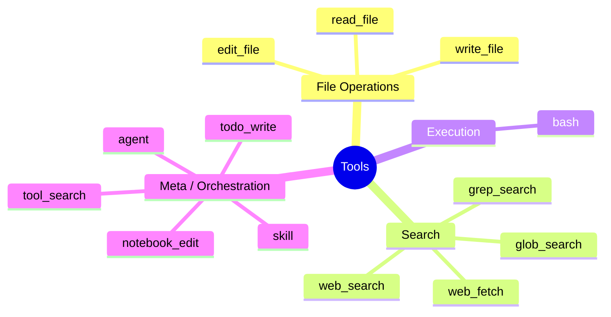
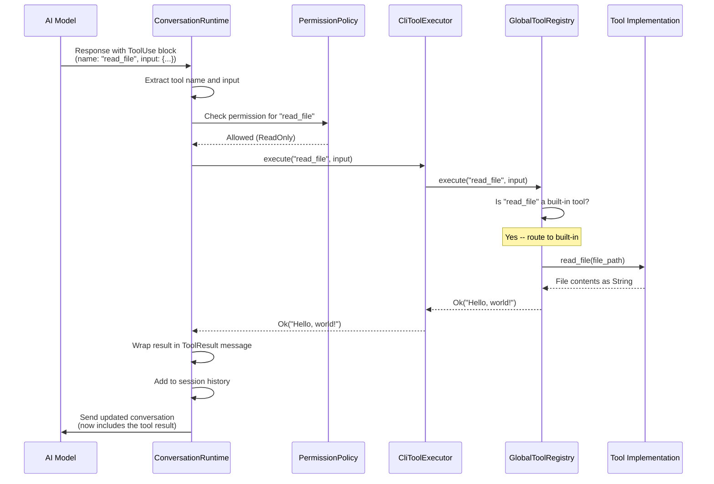

<script setup>
import Annotation from '../.vitepress/theme/Annotation.vue'
import SessionNav from '../.vitepress/theme/SessionNav.vue'
</script>

# Session 4: Tools & Registry

<div class="what-youll-learn">

**What You'll Learn**
- What a "tool" actually is and how it's defined for the AI
- How the 14 built-in tools are organized by category
- How `GlobalToolRegistry` manages both built-in and plugin tools
- The full journey of a tool call, from AI request to executed result

</div>

---

## What Is a Tool?

Imagine you're hiring someone to help you at your desk. You give them a menu of things they can do: "You can read files, search folders, run shell commands." Each item on the menu has a name, a short description, and rules about what information you need to provide. The person reads the menu, picks an action, fills in the details, and hands it back to you to actually do.

That's exactly how tools work in Claw Code. The AI doesn't run tools itself -- it reads a menu of available tools, decides which one to use, and sends back a request. Claw Code then runs the tool and returns the result.

<Annotation type="analogy">
Think of the tool system like a restaurant. The AI is the customer reading the menu. The menu lists every dish (tool) with its name, description, and ingredients (parameters). The customer picks a dish and fills out the order slip -- but the kitchen (Claw Code) does the actual cooking.
</Annotation>

---

## How a Tool Is Defined: `ToolSpec`

Every built-in tool starts as a `ToolSpec`:

```rust
pub struct ToolSpec {
    name: &'static str,
    description: &'static str,
    input_schema: serde_json::Value,  // JSON Schema
    required_permission: PermissionMode,
}
```

In plain English:

| Field | What it means |
|-------|--------------|
| `name` | The tool's identifier, like `"read_file"` or `"bash"` |
| `description` | A short explanation the AI reads to understand what the tool does |
| `input_schema` | A JSON Schema describing what parameters the tool accepts (file paths, search patterns, etc.) |
| `required_permission` | The minimum permission level needed to run this tool (more on this in [Session 5](session-05-permissions.md)) |

The function `mvp_tool_specs()` returns a `Vec<ToolSpec>` -- the complete list of all 14 built-in tools. Think of it as printing out the menu.

---

## The 14 Built-In Tools

Imagine a Swiss Army knife with four fold-out sections. Each section groups related tools together:



### File Operations

| Tool | What it does | Permission |
|------|-------------|------------|
| `read_file` | Read a file's content | ReadOnly |
| `write_file` | Create or overwrite a file | WorkspaceWrite |
| `edit_file` | Replace specific text inside a file | WorkspaceWrite |

These are the most commonly used tools. The AI reads files to understand code, then edits or writes files to make changes.

### Search

| Tool | What it does | Permission |
|------|-------------|------------|
| `glob_search` | Find files by name pattern (e.g., `"**/*.rs"`) | ReadOnly |
| `grep_search` | Search file contents using regex | ReadOnly |
| `web_search` | Search the public web | DangerFullAccess |
| `web_fetch` | Fetch the contents of a URL | DangerFullAccess |

Notice the permission difference: searching local files is `ReadOnly`, but web access is `DangerFullAccess` because it reaches outside your machine.

<Annotation type="warning">
Web tools (`web_search`, `web_fetch`) require `DangerFullAccess` because they make network requests outside your machine. Even seemingly harmless searches cross a trust boundary -- the AI could potentially exfiltrate data through crafted URLs.
</Annotation>

### Execution

| Tool | What it does | Permission |
|------|-------------|------------|
| `bash` | Run a shell command | DangerFullAccess |

This is the most powerful (and most dangerous) tool. It can run any command your shell supports -- `cargo build`, `git status`, `rm -rf /`. That's why it requires the highest permission level.

### Meta / Orchestration

| Tool | What it does | Permission |
|------|-------------|------------|
| `agent` | Spawn a sub-agent (a new AI conversation for a subtask) | DangerFullAccess |
| `todo_write` | Create or update a task list | WorkspaceWrite |
| `notebook_edit` | Edit Jupyter notebook cells | WorkspaceWrite |
| `skill` | Invoke a named skill (a reusable behavior) | DangerFullAccess |
| `tool_search` | Search the tool registry for available tools | ReadOnly |

These tools are about coordination rather than direct action. The `agent` tool is especially interesting -- it lets the AI delegate work to a separate conversation, like a manager assigning a task to a team member.

---

## The Global Tool Registry

Imagine a phone book that lists every tool the AI can use. It has two sections: one for the built-in tools that ship with Claw Code, and one for plugin tools that users or extensions add later.

That phone book is `GlobalToolRegistry`:

```rust
pub struct GlobalToolRegistry {
    plugin_tools: Vec<PluginTool>,
}
```

It only stores `plugin_tools` because the built-in tools come from `mvp_tool_specs()` -- they're always available. The registry combines both sources when asked.

### What the registry can do

```rust
impl GlobalToolRegistry {
    /// Returns all tool definitions (built-in + plugins) for sending to the AI
    pub fn definitions(...) -> Vec<ToolDefinition>

    /// Runs a tool by name and returns the result
    pub fn execute(&self, name: &str, input: &Value) -> Result<String>

    /// Lists every tool with its required permission level
    pub fn permission_specs(...) -> Vec<(String, PermissionMode)>
}
```

| Method | Purpose |
|--------|---------|
| `definitions()` | Builds the "menu" of tools that gets sent to the AI in every API request |
| `execute()` | Looks up a tool by name and runs it, routing to either a built-in implementation or a plugin |
| `permission_specs()` | Returns the permission level for every tool, used by the permission system |

---

## How Tool Definitions Reach the AI

Each `ToolSpec` gets converted into a `ToolDefinition` -- a JSON structure the AI API understands:

```json
{
  "name": "read_file",
  "description": "Read the contents of a file...",
  "input_schema": {
    "type": "object",
    "properties": {
      "file_path": { "type": "string" }
    },
    "required": ["file_path"]
  }
}
```

All the `ToolDefinition`s are included in the `MessageRequest` sent to the API. The AI model reads these definitions and knows exactly which tools it can call and what parameters each one expects.

---

## The `ToolExecutor` Trait

Remember from [Session 3](session-03-conversation-loop.md) that `ConversationRuntime` uses a generic `T: ToolExecutor`. Here's that trait:

```rust
pub trait ToolExecutor {
    fn execute(&mut self, tool_name: &str, input: &str) -> Result<String, ToolError>;
}
```

This is a simple contract: given a tool name and some input, run the tool and return a result string (or an error).

In production, `CliToolExecutor` implements this trait and delegates to `GlobalToolRegistry.execute()`. In tests, a mock executor can return scripted responses. The runtime doesn't care which one it's talking to -- it just calls `execute()`.

<Annotation type="tip">
The `ToolExecutor` trait is a textbook example of the Strategy pattern. By programming against a trait instead of a concrete type, the runtime becomes testable without needing a real filesystem, network, or shell. You can swap in a mock executor that returns canned responses for any tool.
</Annotation>

---

## The Full Execution Journey

Here's what happens from the moment the AI decides to use a tool to when the result comes back:



### The eight steps in plain English

1. **AI responds with a ToolUse block** -- The AI's response includes the tool name (`"read_file"`) and JSON input (`{"file_path": "hello.txt"}`).
2. **Runtime extracts the tool call** -- `ConversationRuntime` pulls the tool name and input out of the response.
3. **Permission check** -- The runtime asks `PermissionPolicy` whether the tool is allowed under the current settings.
4. **`ToolExecutor::execute()` is called** -- The runtime calls the generic executor interface.
5. **Delegation to `GlobalToolRegistry`** -- In production, `CliToolExecutor` passes the call to the registry.
6. **Routing** -- The registry checks whether the tool is built-in or a plugin.
   - **Built-in tools** route to their implementation function (e.g., `execute_bash()`, `read_file()`)
   - **Plugin tools** route to the plugin's execute method
7. **Execution** -- The actual work happens: reading a file, running a command, searching the web, etc.
8. **Result returned** -- The result string travels back up the chain, gets wrapped in a `ToolResult` message, and is added to the session history for the next iteration of the agentic loop.

---

## Built-In vs. Plugin Tools

| Aspect | Built-in tools | Plugin tools |
|--------|---------------|-------------|
| Defined in | `mvp_tool_specs()` in the `tools` crate | Loaded from plugin configuration |
| Always available | Yes | Only when plugin is configured |
| Examples | `read_file`, `bash`, `grep_search` | MCP server tools, custom extensions |
| Routing | Direct function call | Plugin's execute method |

Plugin tools follow the same `ToolDefinition` format, so the AI sees them on the same menu as built-in tools. From the AI's perspective, there's no difference -- it just picks a tool by name.

---

<div class="key-takeaways">

**Key Takeaways**
- A **tool** is a named capability with a description, input schema, and permission level
- `mvp_tool_specs()` defines the 14 built-in tools, grouped into file ops, search, execution, and meta/orchestration
- `GlobalToolRegistry` combines built-in and plugin tools into a single lookup, handling both definition and execution
- Tool definitions are sent to the AI as JSON Schema, so the model knows exactly what it can call and what parameters to provide
- The execution path flows through `ToolExecutor` -> `GlobalToolRegistry` -> implementation function, keeping each layer independent and testable

</div>

<SessionNav
  :current="4"
  :prev="{ text: 'Session 3: Conversation Loop', link: '/architecture/session-03-conversation-loop' }"
  :next="{ text: 'Session 5: Permissions', link: '/architecture/session-05-permissions' }"
/>
