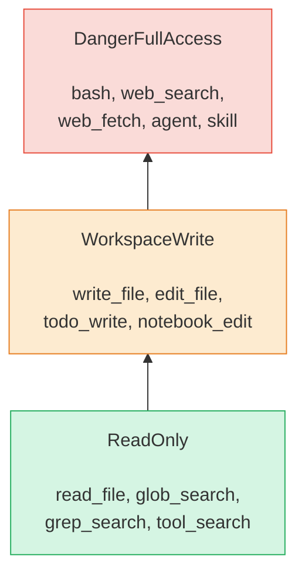
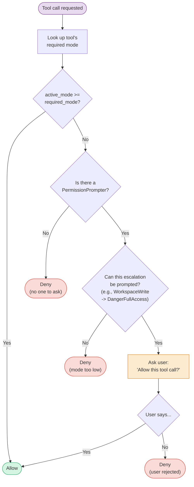
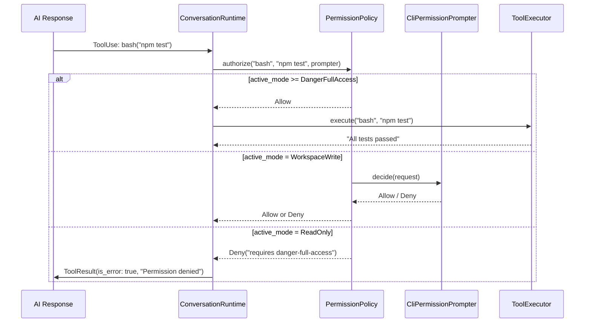

<script setup>
import Annotation from '../.vitepress/theme/Annotation.vue'
import SessionNav from '../.vitepress/theme/SessionNav.vue'
import WhyItWorks from '../.vitepress/theme/WhyItWorks.vue'
import Quiz from '../.vitepress/theme/Quiz.vue'
</script>

# Session 5: The Permission System

<div class="what-youll-learn">

**What You'll Learn**
- Why an AI that can run shell commands needs a permission system
- The three permission modes and how they form a hierarchy
- How the `authorize()` method decides to allow, prompt, or deny a tool call
- How the permission system plugs into the conversation loop from [Session 3](session-03-conversation-loop.md)

</div>

---

## Why Permissions Matter

Imagine you hire an assistant to help around the house. You might trust them to **look through your filing cabinet** (read), and maybe to **organize your desk** (write files). But would you give them your car keys and credit card on day one? Probably not.

An AI that can run `bash` commands has enormous power. It could delete files, install software, or make network requests to arbitrary servers. The permission system is the set of rules that says: "Here's what you're allowed to do — and here's what requires my explicit approval."

Without permissions, every tool call would be an act of blind trust. Permissions let you **dial in exactly how much trust** you want to give.

<Annotation type="info">
The permission system is one of the most critical safety features in Claw Code. It sits directly in the execution path -- every single tool call must pass through it before anything happens on your machine.
</Annotation>

---

## The Three Permission Modes

The permission system defines a strict hierarchy — think of it as three security clearance levels, each one granting more power than the last:



### ReadOnly — "Look but don't touch"

The AI can read files, search through code, and browse tool definitions. It **cannot** change a single byte on disk or run any commands. This is the safest mode — great for exploring a codebase or asking questions about code.

**Tools allowed:** `read_file`, `glob_search`, `grep_search`, `tool_search`

### WorkspaceWrite — "Edit files, but nothing else"

Everything in ReadOnly, plus the ability to create, edit, and write files inside the workspace. The AI still **cannot** run shell commands or access the network. Think of it as giving your assistant a pen and paper but no phone.

**Tools allowed (in addition to ReadOnly):** `write_file`, `edit_file`, `todo_write`, `notebook_edit`

### DangerFullAccess — "I trust you completely"

Everything. The AI can run arbitrary bash commands, fetch web pages, launch sub-agents, and invoke skills. This is the most powerful mode and the one you'd choose when you want the AI to work independently.

**Tools allowed (in addition to WorkspaceWrite):** `bash`, `web_search`, `web_fetch`, `agent`, `skill`

> The name literally says "danger" in it — Claw Code wants you to make a conscious choice when granting this level of access.

<WhyItWorks technique="Principle of Least Privilege">

#### The Everyday Analogy
<div class="analogy">Your friend needs to borrow your car to drive to the store. You give them the car keys — but not your house keys, office keys, or credit cards. They get ONLY what they need. If they lose the car keys, you only lose the car, not your whole life.</div>

#### What Would Go Wrong Without It
<div class="without-it">A compromised AI tool can delete all your files, steal your passwords, and destroy your project. One mistake cascades into total damage. You can't safely use AI tools because you can't trust them with your whole system.</div>

#### Fun Fact
<div class="fun-fact">This principle dates back to the 1970s in military computer systems — it's one of the oldest security ideas that still works perfectly. Every major breach usually happened because someone gave tools or users too much access.</div>

</WhyItWorks>

---

## The Key Structures

Let's look at the actual Rust types that make this work. All of these live in `rust/crates/runtime/src/permissions.rs`.

### The mode enum

```rust
#[derive(Debug, Clone, Copy, PartialEq, Eq, PartialOrd, Ord)]
pub enum PermissionMode {
    ReadOnly,
    WorkspaceWrite,
    DangerFullAccess,
}
```

Three variants, listed from least to most powerful. The `PartialOrd, Ord` at the top tells Rust that these values have a natural ordering — `ReadOnly < WorkspaceWrite < DangerFullAccess`. This ordering is what makes the "is the active mode high enough?" check possible with a simple comparison.

### The policy struct

```rust
pub struct PermissionPolicy {
    active_mode: PermissionMode,
    tool_requirements: BTreeMap<String, PermissionMode>,
}
```

Two fields:
- **`active_mode`** — The permission level the user chose when they started the session (e.g., `WorkspaceWrite`).
- **`tool_requirements`** — A lookup table mapping each tool name to the minimum permission level it requires (e.g., `"bash" -> DangerFullAccess`).

### The outcome enum

```rust
pub enum PermissionOutcome {
    Allow,
    Deny { reason: String },
}
```

Every authorization check produces one of these. Either the tool call is allowed, or it's denied with a human-readable reason explaining why.

### The prompter trait

```rust
pub trait PermissionPrompter {
    fn decide(&mut self, request: &PermissionRequest) -> PermissionPromptDecision;
}
```

This is the "ask the user" escape hatch. When the active mode isn't high enough but a prompter is available, the system can ask you: "The AI wants to run `bash('rm -rf /tmp/old')`. Allow? [y/n]"

If you remember the `ToolExecutor` trait from [Session 4](session-04-tools-and-registry.md), this follows the same pattern: define a trait so different implementations can be swapped in. In production, the CLI shows a real terminal prompt. In tests, a mock prompter auto-allows or auto-denies.

<Annotation type="detail">
The `PermissionPrompter` trait uses the same dependency inversion pattern as `ToolExecutor`. This consistency across the codebase means that once you understand one trait-based boundary, you understand them all -- testability through abstraction.
</Annotation>

---

## How `authorize()` Makes Its Decision

Imagine a bouncer at a club. They check your ID (the active mode), compare it to the entry requirement (the tool's required mode), and either let you in, ask the manager (the prompter), or turn you away.

Here's the decision tree:



Let's walk through the logic step by step:

### Step 1: Look up the requirement

```rust
let required_mode = self.required_mode_for(tool_name);
```

The policy checks its `tool_requirements` map. If the tool isn't registered, it defaults to `DangerFullAccess` — the safest assumption is that an unknown tool needs the highest clearance.

### Step 2: Compare modes

```rust
if current_mode >= required_mode {
    return PermissionOutcome::Allow;
}
```

Because `PermissionMode` has an ordering (`ReadOnly < WorkspaceWrite < DangerFullAccess`), this is a simple comparison. If you're in `DangerFullAccess` mode, **everything** is allowed. If you're in `WorkspaceWrite` mode, read and write tools are allowed, but bash isn't.

### Step 3: Prompt or deny

If the active mode isn't high enough, the system checks whether a prompter is available and whether this particular escalation is something that can be prompted for. For example, when you're in `WorkspaceWrite` mode and a `DangerFullAccess` tool is requested, Claw Code can ask you: "Allow this one call?"

If there's no prompter (e.g., running in a non-interactive script), the tool is denied automatically with a message like:

```
tool 'bash' requires approval to escalate from workspace-write to danger-full-access
```

---

## How It Fits Into the Conversation Loop

Remember the flowchart from [Session 3](session-03-conversation-loop.md)? After the AI responds with a tool call, the very first thing the runtime does is check permissions:



When a tool call is **denied**, the runtime doesn't just stop. It sends the denial reason back to the AI as an error `ToolResult`. The AI sees the error message, understands it doesn't have permission, and adjusts its approach. For example, if `bash` is denied, the AI might say: "I can't run commands in your current permission mode. Would you like to switch to a higher permission level, or should I just describe what command to run?"

This is the same loop you saw in Session 3 — the permission check is just one gate in the pipeline, sitting between "AI requests tool" and "tool executes."

<Quiz
  question="If the permission mode is set to WorkspaceWrite and the AI tries to run a bash command, what happens?"
  :options="['The command runs normally', 'The user is prompted to allow or deny', 'The request is automatically denied', 'The system crashes']"
  :correct="2"
  explanation="bash requires DangerFullAccess permission. Since WorkspaceWrite is lower than DangerFullAccess, the request is denied. The AI receives an error result saying 'permission denied' and adjusts its approach."
/>

---

## The PermissionPrompter in Practice

### In the CLI

When you're using Claw Code interactively and a tool needs escalation, the `CliPermissionPrompter` prints something like:

```
The AI wants to run: bash("rm -rf /tmp/old")
Allow? [y/n]
```

You see exactly what the AI wants to do and make the call. This is the **interactive safety net** — even if you chose `WorkspaceWrite` mode, you can allow specific dangerous operations one at a time.

### In tests

Tests use a `RecordingPrompter` — a mock that either auto-allows or auto-denies everything, and records what it was asked. Here's a simplified version from the actual test code:

```rust
struct RecordingPrompter {
    seen: Vec<PermissionRequest>,
    allow: bool,
}

impl PermissionPrompter for RecordingPrompter {
    fn decide(&mut self, request: &PermissionRequest) -> PermissionPromptDecision {
        self.seen.push(request.clone());
        if self.allow {
            PermissionPromptDecision::Allow
        } else {
            PermissionPromptDecision::Deny {
                reason: "not now".to_string(),
            }
        }
    }
}
```

This lets tests verify that the right permission requests were made without needing a human at the keyboard.

---

## Tool Permission Mapping

Here's the full mapping of which tools require which permission level, as registered in the tools crate (see [Session 4](session-04-tools-and-registry.md)):

| Permission Level | Tools |
|-----------------|-------|
| **ReadOnly** | `read_file`, `glob_search`, `grep_search`, `tool_search` |
| **WorkspaceWrite** | `write_file`, `edit_file`, `todo_write`, `notebook_edit` |
| **DangerFullAccess** | `bash`, `web_search`, `web_fetch`, `agent`, `skill` |

The rule of thumb: if a tool can **only observe**, it's ReadOnly. If it can **change files** in the workspace, it's WorkspaceWrite. If it can **escape the workspace** (run arbitrary commands, access the network, launch other agents), it's DangerFullAccess.

<Annotation type="tip">
When adding a new tool, ask yourself: "Can this tool affect anything outside the workspace?" If yes, it should be `DangerFullAccess`. If it only modifies files in the project directory, `WorkspaceWrite`. If it only reads, `ReadOnly`.
</Annotation>

---

<div class="key-takeaways">

**Key Takeaways**
- The permission system prevents the AI from doing dangerous things without your approval
- Three modes form a hierarchy: **ReadOnly < WorkspaceWrite < DangerFullAccess** — each level includes everything below it
- The `authorize()` method compares the active mode to the tool's required mode and either allows, prompts the user, or denies
- When a tool is denied, the AI receives the denial as an error and adapts its approach
- The `PermissionPrompter` trait lets the CLI ask the user interactively, while tests use a mock — same pattern as `ToolExecutor` from [Session 4](session-04-tools-and-registry.md)

</div>

<SessionNav
  :current="5"
  :prev="{ text: 'Session 4: Tools & Registry', link: '/architecture/session-04-tools-and-registry' }"
  :next="{ text: 'Session 6: Config & Prompts', link: '/architecture/session-06-config-and-prompts' }"
/>
