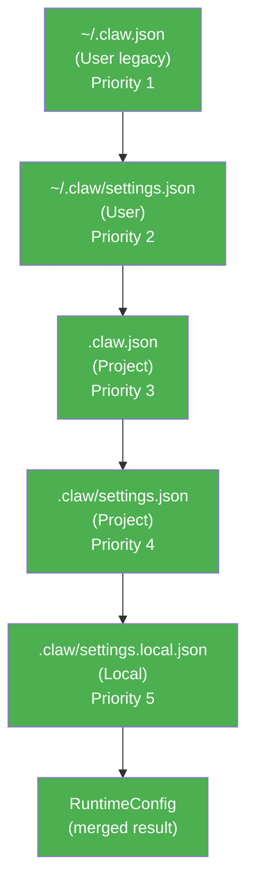
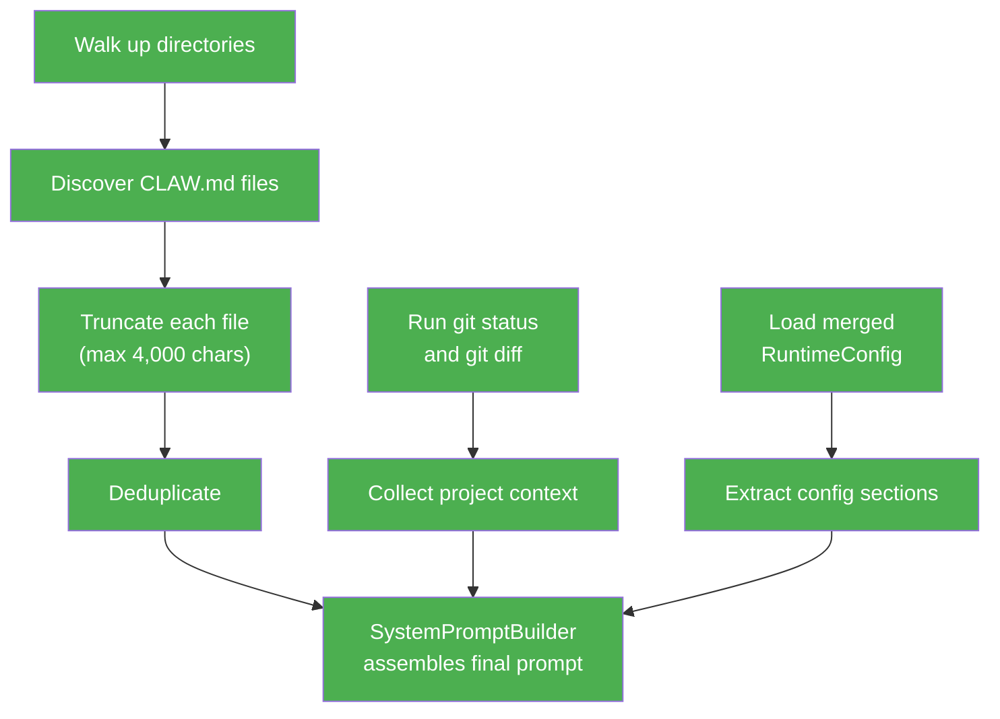

<script setup>
import Annotation from '../.vitepress/theme/Annotation.vue'
import SessionNav from '../.vitepress/theme/SessionNav.vue'
</script>

# Session 6: Configuration and System Prompts

<div class="what-youll-learn">

**What You'll Learn**
- How Claw Code discovers and merges configuration files from five different locations
- Why later config files override earlier ones (the "layering" principle)
- How the system prompt is assembled from multiple sources before the AI sees your message
- What budget limits prevent the prompt from growing too large

</div>

---

## Part 1: Configuration Hierarchy

### The Analogy

Imagine you're getting dressed for school. You start with a base layer -- a t-shirt you wear every day no matter what. Then you add a jacket that matches the class you're going to. Finally, you adjust for the weather at your specific location -- maybe you roll up your sleeves because the room is warm. Each layer can override the one below it. That's exactly how Claw Code's configuration works.

### Where Config Files Live

Claw Code looks for JSON config files in five locations, checked in this order. Each location has a **scope** that describes how broadly it applies:

| Priority | Path | Scope | Purpose |
|----------|------|-------|---------|
| 1 (lowest) | `~/.claw.json` | User | Legacy user-wide defaults |
| 2 | `~/.claw/settings.json` | User | User-wide settings |
| 3 | `.claw.json` | Project | Project root config |
| 4 | `.claw/settings.json` | Project | Project settings folder |
| 5 (highest) | `.claw/settings.local.json` | Local | Machine-local overrides (not committed to git) |

The key rule: **later files win**. If your user config says `"model": "fast"` but your project config says `"model": "smart"`, the project config wins because it has higher priority.

<Annotation type="analogy">
Config layering works like CSS specificity. Global user settings are like a browser's default stylesheet. Project config is like a site-level stylesheet. Local overrides are like inline styles -- they always win because they are the most specific to your situation.
</Annotation>

### The Config Structures in Rust

Here is the loader that finds those files on disk:

```rust
pub struct ConfigLoader {
    cwd: PathBuf,        // The current working directory
    config_home: PathBuf, // Usually ~/.claw
}
```

`ConfigLoader` takes two paths -- where you are right now (`cwd`) and where your home config lives (`config_home`). It walks through the five locations, reads each file that exists, and passes them to the next structure.

Once all files are loaded, they get merged into a single runtime config:

```rust
pub struct RuntimeConfig {
    merged: BTreeMap<String, JsonValue>,   // All settings flattened into one map
    loaded_entries: Vec<ConfigEntry>,       // Which files were actually loaded
    feature_config: RuntimeFeatureConfig,  // Parsed feature flags
}
```

- `merged` is the final, flattened result -- every key from every config file, with higher-priority values overwriting lower-priority ones.
- `loaded_entries` keeps a record of which files were found and loaded (useful for debugging "why is this setting active?").
- `feature_config` breaks the merged result into typed, structured fields.

The feature config holds the real settings the runtime cares about:

```rust
pub struct RuntimeFeatureConfig {
    hooks: RuntimeHookConfig,
    plugins: RuntimePluginConfig,
    mcp: McpConfigCollection,
    oauth: Option<OAuthConfig>,
    model: Option<String>,
    permission_mode: Option<ResolvedPermissionMode>,
    sandbox: SandboxConfig,
}
```

Each field controls a specific feature: which hooks run, which plugins are active, what model to use, whether sandboxing is on, and so on. The `Option<...>` fields mean "this might not be set at all" -- if no config file specifies a model, `model` will be `None` and the system uses a default.

### Config Layering Diagram



Each box feeds into the next. When two files define the same key, the higher-priority file's value is kept.

---

## Part 2: System Prompt Assembly

### The Analogy

Imagine a new employee's first day at a company. Before they start working, someone hands them a briefing packet. It explains: "Here's who you are. Here's the project you're on. Here's what the codebase looks like right now. Here are the rules you need to follow." The system prompt is that briefing packet -- it's everything the AI reads before it ever sees your message. And just like a real briefing, there's a page limit: you can't hand someone a 500-page manual and expect them to absorb it all.

### What Is a System Prompt?

The system prompt is a block of text sent to the AI **before** your conversation begins. It tells the AI:

- What tool it is (Claw Code, a CLI assistant)
- What project it's working in
- What the current git status looks like
- What rules to follow (from CLAW.md files and config)

The user never sees this prompt directly, but it shapes every response the AI gives.

### The Builder and Its Context

```rust
pub struct SystemPromptBuilder { ... }
```

The builder collects all the pieces and assembles them in the right order. It relies on a `ProjectContext` to understand the current project:

```rust
pub struct ProjectContext {
    cwd: PathBuf,                         // Current working directory
    current_date: String,                 // Today's date
    git_status: Option<String>,           // Output of `git status`
    git_diff: Option<String>,             // Output of `git diff`
    instruction_files: Vec<ContextFile>,  // CLAW.md files found
}
```

This tells the AI where it is, what day it is, and what the codebase looks like right now (uncommitted changes, current branch, etc.).

Each instruction file is represented as:

```rust
pub struct ContextFile {
    path: PathBuf,
    content: String,  // truncated to MAX_INSTRUCTION_FILE_CHARS = 4,000
}
```

Notice the truncation. A single CLAW.md file can be at most 4,000 characters. This prevents one enormous instruction file from eating up the entire prompt budget.

### CLAW.md Discovery

The system walks **up** from your current directory, checking every ancestor until it reaches the filesystem root. At each directory, it looks for:

- `{dir}/CLAW.md`
- `{dir}/CLAW.local.md`
- `{dir}/.claw/CLAW.md`
- `{dir}/.claw/instructions.md`

So if you're working in `/home/you/projects/my-app/src/components`, the system checks:

1. `/home/you/projects/my-app/src/components/CLAW.md`
2. `/home/you/projects/my-app/src/CLAW.md`
3. `/home/you/projects/my-app/CLAW.md`
4. `/home/you/projects/CLAW.md`
5. ... all the way up to `/CLAW.md`

(And the same for the other three filenames at each level.)

This means a monorepo can have a top-level CLAW.md with global rules, and each sub-package can have its own CLAW.md with package-specific instructions.

<Annotation type="tip">
In a monorepo, place shared coding conventions in the root `CLAW.md` and package-specific rules (like "always use `async/await` in this service" or "this package targets ES5") in each sub-package's `CLAW.md`. The system will discover and include all of them.
</Annotation>

### Assembly Order

The system prompt is assembled in this specific order:

| Step | Section | What It Contains |
|------|---------|-----------------|
| 1 | Intro | Output style guidelines |
| 2 | System | Permissions, tool execution model |
| 3 | Doing Tasks | "Read before changing", scope rules |
| 4 | Actions | Reversibility, blast radius guidance |
| 5 | Boundary | Dynamic marker separating static from dynamic content |
| 6 | Environment | Model name, cwd, date, platform info |
| 7 | Project Context | Git status, git diff output |
| 8 | Instruction Files | CLAW.md contents (truncated, deduplicated) |
| 9 | Config | Loaded .claw.json entries |
| 10 | Appended | LSP context, hooks, extra sections |

Steps 1-4 are static -- they're the same every time. Steps 5-10 are dynamic -- they change based on your project, your config, and the current state of your codebase.

### Budget Limits

The system prompt can't grow forever. Two constants keep it in check:

| Constant | Value | Meaning |
|----------|-------|---------|
| `MAX_INSTRUCTION_FILE_CHARS` | 4,000 | Maximum characters per single CLAW.md file |
| `MAX_TOTAL_INSTRUCTION_CHARS` | 12,000 | Maximum characters across all instruction files combined |

If a file exceeds 4,000 characters, it's cut off and a `[truncated]` marker is appended. If all instruction files together exceed 12,000 characters, the system stops including additional files.

This is like saying "the briefing packet can be at most 3 pages, and no single section can be more than 1 page."

<Annotation type="warning">
If your CLAW.md files are being truncated, keep instructions concise and prioritize the most important rules at the top of each file. Content beyond the 4,000-character limit per file will be silently cut off with a `[truncated]` marker.
</Annotation>

### Prompt Assembly Diagram



Three streams of data -- instruction files, git context, and config -- all flow into the `SystemPromptBuilder`, which combines them with the static sections (intro, system, tasks, actions) to produce the final prompt.

---

<div class="key-takeaways">

**Key Takeaways**
- **Five config locations, one merged result.** Config files are discovered from user-global down to machine-local, with later files overriding earlier ones.
- **The system prompt is a briefing packet.** It tells the AI who it is, what it's working on, and what rules to follow -- all before the user's first message.
- **CLAW.md files are discovered by walking up.** Every ancestor directory is checked, so monorepos can layer global and package-specific instructions.
- **Budget limits prevent bloat.** No single instruction file can exceed 4,000 characters, and all files together are capped at 12,000 characters.
- **Config and prompts work together.** The merged config feeds into the system prompt, so your settings directly influence how the AI behaves.

</div>

<SessionNav
  :current="6"
  :prev="{ text: 'Session 5: Permissions', link: '/architecture/session-05-permissions' }"
  :next="{ text: 'Session 7: Streaming & API', link: '/architecture/session-07-streaming' }"
/>
