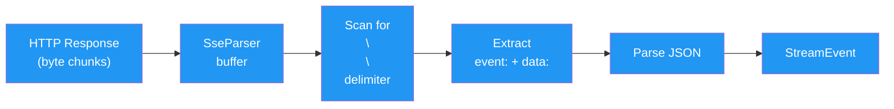
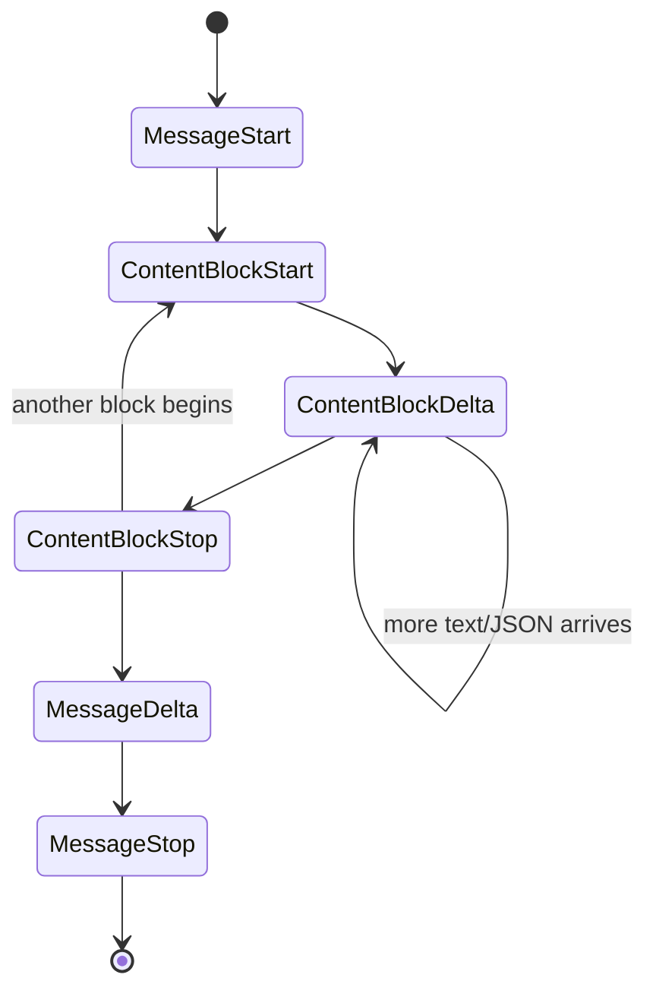
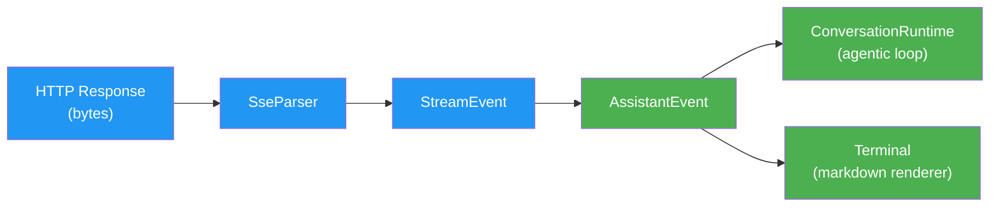

<script setup>
import Annotation from '../.vitepress/theme/Annotation.vue'
import SessionNav from '../.vitepress/theme/SessionNav.vue'
</script>

# Session 7: Streaming and the API Client

<div class="what-youll-learn">

**What You'll Learn**
- How Server-Sent Events (SSE) let you see the AI's response as it's being generated, instead of waiting for the whole thing
- How the `api` crate is structured: providers, authentication, and retry logic
- How raw bytes from the network become structured events your code can use
- How `StreamEvent`s are translated into simpler `AssistantEvent`s that the runtime understands

</div>

---

## Part 1: What Is SSE?

### The Analogy

Imagine ordering food at a restaurant. Without streaming, you'd sit at an empty table for 30 minutes, and then the waiter would bring your appetizer, salad, and main course all at once. With streaming (SSE), the waiter brings each dish as soon as it's ready -- appetizer first, then salad, then the main course. You start eating immediately instead of staring at an empty table.

### The Technical Version

SSE stands for **Server-Sent Events**. It's a way for a server to send data to a client in a continuous stream over a single HTTP connection. Instead of:

1. Client sends request
2. Server thinks for 30 seconds
3. Server sends one big response

You get:

1. Client sends request
2. Server starts thinking
3. Server sends a small piece as soon as it's ready
4. Server sends the next piece
5. (repeat until done)
6. Server closes the connection

Each piece is called a **frame**. A frame looks like this in the raw HTTP response:

```
event: content_block_delta
data: {"type":"content_block_delta","delta":{"type":"text_delta","text":"Hello"}}

event: content_block_delta
data: {"type":"content_block_delta","delta":{"type":"text_delta","text":" world"}}

```

Notice the blank line between frames -- that double newline (`\n\n`) is the delimiter that separates one frame from the next.

<Annotation type="analogy">
SSE is like a live news ticker scrolling across the bottom of a TV screen. Each headline appears as soon as it's ready -- you don't wait for every headline of the day to be written before the ticker starts scrolling.
</Annotation>

---

## Part 2: The API Crate Architecture

Source files: `rust/crates/api/src/`

The `api` crate is responsible for everything related to talking to AI providers over the network. It's colored blue in our architecture diagrams because it sits at the bottom of the dependency chain -- the runtime depends on it, but it depends on nothing else in the workspace.

### Providers

Claw Code can talk to multiple AI providers. The `ProviderClient` enum determines which one:

```rust
pub enum ProviderClient {
    ClawApi(ClawApiClient),      // Anthropic API
    Xai(OpenAiCompatClient),     // xAI (Grok)
    OpenAi(OpenAiCompatClient),  // OpenAI
}
```

How does Claw Code know which provider to use? It looks at the **model name**. If the model starts with `claude-`, it uses the `ClawApi` provider. If it starts with `grok-`, it uses `Xai`. This is simple pattern matching -- no config needed.

Notice that `Xai` and `OpenAi` both use the same underlying `OpenAiCompatClient`. That's because xAI and OpenAI use compatible API formats, so one client implementation handles both.

### The Claw API Client

The primary client that talks to Anthropic's API:

```rust
pub struct ClawApiClient {
    http: reqwest::Client,
    auth: AuthSource,
    base_url: String,
    max_retries: u32,
    initial_backoff: Duration,
    max_backoff: Duration,
}
```

In plain English:

| Field | What it does |
|-------|-------------|
| `http` | The HTTP client that sends requests over the network |
| `auth` | How to authenticate (API key, OAuth token, or both) |
| `base_url` | Where to send requests (usually `https://api.anthropic.com`) |
| `max_retries` | How many times to retry a failed request before giving up |
| `initial_backoff` | How long to wait before the first retry |
| `max_backoff` | The longest we'll ever wait between retries |

### Authentication

```rust
pub enum AuthSource {
    None,
    ApiKey(String),
    BearerToken(String),
    ApiKeyAndBearer { api_key: String, bearer_token: String },
}
```

Most users will use `ApiKey` -- you set your `ANTHROPIC_API_KEY` environment variable and Claw Code picks it up. The `BearerToken` variant is used after running `claw login` for OAuth authentication. `ApiKeyAndBearer` supports scenarios where both are needed at the same time.

---

## Part 3: The SSE Parser

Source file: `rust/crates/api/src/sse.rs`

### The Analogy

Imagine you're receiving a long letter, but it's being slid under your door one torn piece at a time. Some pieces contain a complete sentence. Some contain half a sentence -- you need to wait for the next piece to finish it. The SSE parser's job is to collect these torn pieces, reassemble them into complete sentences, and hand each finished sentence to the rest of the system.

### The Structure

```rust
pub struct SseParser {
    buffer: Vec<u8>,
}
```

That's it -- just a buffer of bytes. The simplicity is intentional. Here's how it works step by step:

1. **Raw bytes arrive** from the HTTP response in chunks (the "torn pieces")
2. **`SseParser` accumulates them** in its buffer
3. **It scans for the frame delimiter** -- two consecutive newlines (`\n\n`)
4. **When it finds one**, it extracts everything before the delimiter as a complete frame
5. **Each frame is parsed** into `event:` and `data:` lines
6. **The `data:` line is parsed as JSON** into a `StreamEvent`
7. **Special frames are filtered out** -- `ping` events (keep-alive heartbeats) and `[DONE]` markers (end of stream) are discarded

### Parsing Flow Diagram



---

## Part 4: Stream Event Types

Once the SSE parser extracts a JSON frame, it becomes a `StreamEvent`. These events describe the lifecycle of a single AI response:

```rust
pub enum StreamEvent {
    MessageStart(MessageStartEvent),
    ContentBlockStart(ContentBlockStartEvent),
    ContentBlockDelta(ContentBlockDeltaEvent),
    ContentBlockStop(ContentBlockStopEvent),
    MessageDelta(MessageDeltaEvent),
    MessageStop(MessageStopEvent),
}
```

### The Lifecycle

Think of it like a book being read aloud. `MessageStart` is "I'm going to start reading." `ContentBlockStart` is "Here comes a new chapter." `ContentBlockDelta` is each sentence being read. `ContentBlockStop` is "That chapter is done." And `MessageStop` is "The whole book is finished."



A single message can contain **multiple content blocks**. For example, the AI might produce a text block ("Here's what I'll do...") followed by a tool-use block (the actual tool call). Each block goes through the Start-Delta-Stop cycle independently.

### What's Inside a Delta?

The delta events carry the actual content, piece by piece:

```rust
pub enum ContentBlockDelta {
    TextDelta { text: String },
    InputJsonDelta { partial_json: String },
    ThinkingDelta { thinking: String },
}
```

- `TextDelta` -- a fragment of the AI's written response (e.g., `"Hello"`, then `" world"`, then `"!"`)
- `InputJsonDelta` -- a fragment of JSON for a tool call's input (the AI builds it incrementally)
- `ThinkingDelta` -- a fragment of the AI's internal reasoning (when extended thinking is enabled)

<Annotation type="detail">
The AI builds tool-call JSON incrementally via `InputJsonDelta`. This means the JSON is invalid until the final fragment arrives. The runtime accumulates these fragments and only parses the complete JSON after `ContentBlockStop`.
</Annotation>

---

## Part 5: From StreamEvent to AssistantEvent

Remember from [Session 3](session-03-conversation-loop.md) that the `ConversationRuntime` orchestrates the agentic loop. The runtime doesn't work with `StreamEvent` directly -- those are too low-level and API-specific. Instead, stream events are translated into simpler `AssistantEvent`s.

This translation happens in the streaming layer of `claw-cli/src/main.rs`:

```rust
pub enum AssistantEvent {
    TextDelta(String),
    ToolUse { id: String, name: String, input: serde_json::Value },
    Usage(TokenUsage),
    MessageStop,
}
```

In plain English:

| AssistantEvent | What it means |
|---------------|--------------|
| `TextDelta(String)` | "Here's the next piece of text to show the user" |
| `ToolUse { id, name, input }` | "The AI wants to run this tool with this input" |
| `Usage(TokenUsage)` | "Here's how many tokens were used (for cost tracking)" |
| `MessageStop` | "The AI is done responding" |

Notice how much simpler this is than `StreamEvent`. Six variants collapsed into four. The `ContentBlockStart` and `ContentBlockStop` bookkeeping events are absorbed -- the runtime doesn't need to know about block boundaries. It just cares about text to display, tools to run, usage to track, and knowing when the response is done.

### The Full Pipeline

Here's the complete journey from HTTP response to terminal output, tying back to what we learned in [Session 3](session-03-conversation-loop.md):



The blue boxes are the `api` crate's responsibility. The green boxes are the runtime and CLI. `TextDelta` events flow to **both** the runtime (so it can build the complete message for history) and the terminal (so you see text appearing in real time). This is why the AI's response seems to "type itself out" on your screen -- each delta is rendered the moment it arrives.

---

## Part 6: What Gets Sent TO the API

So far we've talked about what comes *back* from the API. But what gets sent *to* it? The `MessageRequest` struct:

```rust
pub struct MessageRequest {
    model: String,
    max_tokens: u32,
    messages: Vec<InputMessage>,
    system: Option<String>,
    tools: Option<Vec<ToolDefinition>>,
    tool_choice: Option<ToolChoice>,
    stream: bool,
}
```

| Field | What it does |
|-------|-------------|
| `model` | Which AI model to use (e.g., `"claude-opus-4-6"`) |
| `max_tokens` | The maximum number of tokens the AI can generate in its response |
| `messages` | The full conversation history -- every message from user and AI so far |
| `system` | The system prompt (assembled in [Session 6](session-06-config-and-prompts.md)) |
| `tools` | Definitions of all available tools (name, description, input schema) |
| `tool_choice` | Whether the AI *must* use a tool, *can* use a tool, or should respond with text only |
| `stream` | Set to `true` to get SSE streaming (which is what we've been discussing this whole session) |

The `messages` field is the key connection to [Session 3](session-03-conversation-loop.md). Each iteration of the agentic loop appends new messages (the AI's response, tool results, etc.) and sends the growing history back to the API. The AI sees the entire conversation every time, which is how it maintains context across multiple tool calls.

---

## Part 7: Retry Logic

Network requests fail. Servers get overloaded. Connections drop. The `send_with_retry()` method handles this gracefully using **exponential backoff**:

### The Analogy

Imagine you're trying to call a friend but they don't pick up. You wait 1 second and try again. No answer. You wait 2 seconds and try again. Still nothing. You wait 4 seconds. Then 8. Then 16. You keep doubling the wait time so you don't overwhelm their phone with constant calls. And after, say, 5 attempts, you give up entirely.

### How It Works

1. Send the request
2. If it succeeds, great -- return the response
3. If it fails with a retryable error (like a 429 "too many requests" or 500 "server error"):
   - Wait `initial_backoff` (e.g., 1 second)
   - Try again
   - If it fails again, wait `initial_backoff * 2`
   - Keep doubling, but never exceed `max_backoff`
4. After `max_retries` total attempts, return the error

This pattern is called **exponential backoff** and it's used throughout the software industry. It balances two goals: retrying quickly when the problem is brief, and backing off when the server needs time to recover.

<Annotation type="tip">
When debugging streaming issues, check the `SseParser` buffer first. If frames are arriving but not being parsed, the most common cause is a missing double-newline delimiter -- some proxies or middleware may strip trailing newlines.
</Annotation>

---

<div class="key-takeaways">

**Key Takeaways**
- **SSE lets you see the AI's response as it's generated.** Instead of waiting 30 seconds for a complete response, text appears on your screen word by word.
- **The `SseParser` turns raw bytes into structured events.** It buffers incoming data, splits on `\n\n` delimiters, and parses the JSON inside each frame.
- **Stream events follow a strict lifecycle.** `MessageStart` then one or more content blocks (each with Start-Delta-Stop), then `MessageDelta`, then `MessageStop`.
- **`StreamEvent` is simplified into `AssistantEvent` for the runtime.** The runtime only needs to know about text, tool calls, usage, and completion -- not the low-level block boundaries.
- **Exponential backoff handles network failures gracefully.** Failed requests are retried with increasing wait times, preventing both silent failures and server overload.

</div>

---

<SessionNav
  :current="7"
  :prev="{ text: 'Session 6: Config & Prompts', link: '/architecture/session-06-config-and-prompts' }"
  :next="{ text: 'Session 8: CLI & Rendering', link: '/architecture/session-08-cli-and-rendering' }"
/>
