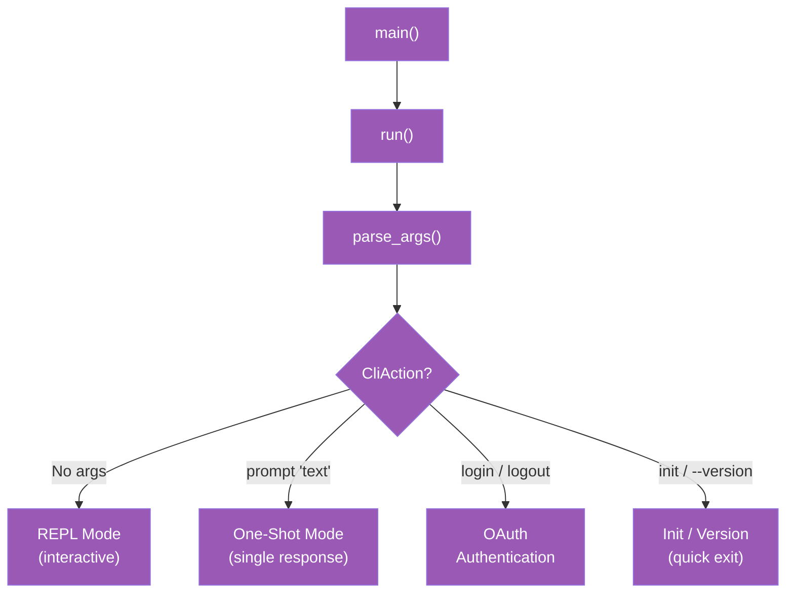
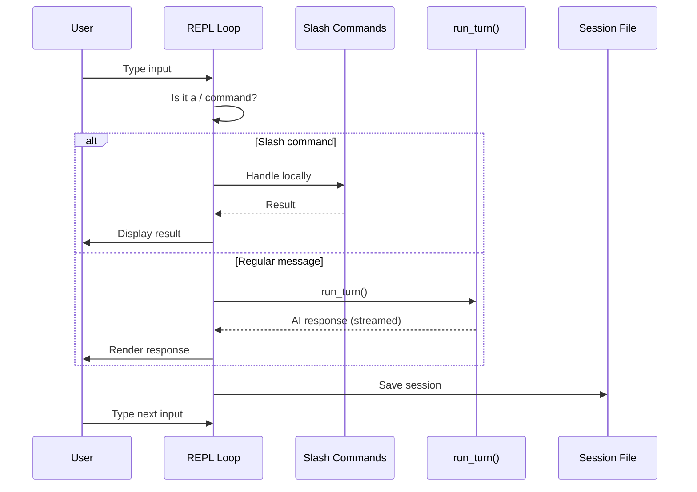
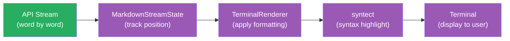

<script setup>
import Annotation from '../.vitepress/theme/Annotation.vue'
import SessionNav from '../.vitepress/theme/SessionNav.vue'
</script>

# Session 8: The CLI and Terminal Rendering

<div class="what-youll-learn">

**What You'll Learn**
- How the program starts up and decides what mode to run in (REPL, one-shot, login, etc.)
- How the REPL loop reads your input, processes it, and displays the AI's response
- How markdown is rendered in real time as the AI streams its answer
- How slash commands work and how sessions are saved to disk

</div>

---

## Part 1: The Entry Point

### The Analogy

Imagine a restaurant with a front desk. When you walk in, the host asks: "Table for dinner, or are you here for a takeout order?" Depending on your answer, you're routed to a completely different experience -- sit-down service with a waiter, or a quick pickup at the counter. The CLI's entry point works the same way. It looks at what you typed and routes you to the right experience.

### How main() Starts

The program's entry point lives in `rust/crates/claw-cli/src/main.rs`. Here's the chain of function calls:

```
main() (line 60)
  -> run() (line 71)
      -> parse_args() (line 162)
```

`main()` is tiny -- it just calls `run()`. The real work begins in `run()`, which calls `parse_args()` to figure out what you want to do.

### What parse_args() Decides

`parse_args()` looks at the command-line arguments you typed and returns a `CliAction` -- an enum that describes what mode to run in:

| What you type | CliAction | What happens |
|---------------|-----------|-------------|
| `claw` (no arguments) | REPL mode | Interactive conversation -- you type, the AI responds, repeat |
| `claw prompt "fix the bug"` | One-shot mode | Send one message, get one answer, exit |
| `claw login` | Login | Start OAuth authentication |
| `claw logout` | Logout | Clear saved credentials |
| `claw init` | Init | Create a `.claw.json` config file for your project |
| `claw --version` | Version | Print the version number and exit |
| `claw --resume` | Resume | Pick up a saved session where you left off |

There are also flags that modify behavior without changing the mode:

- `--model` -- choose which AI model to use
- `--permission-mode` -- set how strict permissions are
- `--allowedTools` -- limit which tools the AI can use
- `--output-format` -- change output format (e.g., JSON for scripts)

### Startup Flow Diagram



Purple boxes here because this is all `claw-cli` code -- the main binary crate that handles everything the user directly interacts with.

<Annotation type="info">
The `CliAction` enum is exhaustive -- every possible way to invoke the CLI maps to exactly one variant. This makes it impossible to forget handling a new mode, because the Rust compiler will warn about unmatched variants.
</Annotation>

---

## Part 2: The REPL Loop

### The Analogy

Imagine a conversation with a friend over text messaging. You type a message, they read it and reply, you read their reply and type another message. This back-and-forth repeats until one of you says "bye." The REPL loop is exactly that -- an endless conversation loop between you and the AI.

REPL stands for **Read-Eval-Print Loop**:
- **Read** -- get input from the user
- **Eval** -- evaluate it (send to the AI or handle a command)
- **Print** -- display the result
- **Loop** -- go back to step 1

### How run_repl() Works

The `run_repl()` function (line 960 in `main.rs`) is the heart of interactive mode. Here's what it does:

1. **Setup** -- Creates a `LiveCli` with the configured model, permissions, and system prompt
2. **Banner** -- Displays startup info: which model, what permission mode, which directory, the session ID
3. **Loop** -- Enters the main loop:
   - Read input from the user (via `LineEditor`)
   - Check: does the input start with `/`?
   - If yes, it's a slash command -- handle it locally (e.g., `/help`, `/status`)
   - If no, it's a regular message -- call `run_turn()` to send it to the AI
   - Save the session to disk
   - Repeat

### REPL Loop Diagram



Notice that `run_turn()` is where the REPL connects to the conversation loop from [Session 3](session-03-conversation-loop.md). The REPL handles the user-facing experience; the conversation loop handles the AI interaction.

---

## Part 3: Input Handling

### The Analogy

Imagine a text editor that's also a command line. You can type normally, but you can also press special key combinations to do things like undo, copy, or jump to a specific line. The `LineEditor` is like a tiny text editor built just for typing messages to the AI.

### The LineEditor

The input handling lives in `rust/crates/claw-cli/src/input.rs` (1,119 lines). The `LineEditor` supports several modes, inspired by the Vim text editor:

- **Insert mode** -- Normal typing. What you'd expect.
- **Normal mode** -- Vim-style navigation (press `Esc` to enter, `i` to go back to Insert)
- **Visual mode** -- Select text with keyboard
- **Command mode** -- Type `:` commands (like `:q` to quit)

Even if you've never used Vim, the default Insert mode works like any normal text input.

### Key Bindings

| Key | What it does |
|-----|-------------|
| `Enter` | Submit your message |
| `Shift+Enter` or `Ctrl+J` | Add a new line (for multi-line messages) |
| `Up/Down arrows` | Browse command history |
| `Ctrl+C` | Cancel current input |
| `Ctrl+D` | Exit the session |

### ReadOutcome

When the user finishes typing, the `LineEditor` returns a `ReadOutcome`:

```rust
enum ReadOutcome {
    Submit(String),  // User pressed Enter -- here's their text
    Cancel,          // User pressed Ctrl+C -- discard and start over
    Exit,            // User pressed Ctrl+D -- end the session
}
```

In plain English: every time you interact with the input, exactly one of three things happens. You either submit a message, cancel what you were typing, or quit entirely. The REPL loop checks which one it got and acts accordingly.

<Annotation type="tip">
The Vim-style keybindings are optional -- Insert mode is the default experience. If you've never used Vim, you can ignore Normal, Visual, and Command modes entirely. They're there for power users who prefer modal editing.
</Annotation>

---

## Part 4: Terminal Rendering

### The Analogy

Imagine watching a live sports broadcast. The commentator speaks one word at a time, but the graphics team needs to show scores, highlights, and replays in real time as the game unfolds. They can't wait until the game is over to display everything -- they have to render graphics *while the action is happening*. Terminal rendering works the same way: the AI sends its response word by word, and the renderer has to display formatted markdown in real time, even before the full response arrives.

### The Key Components

The rendering system lives in `rust/crates/claw-cli/src/render.rs` (797 lines). It has four main components:

**1. TerminalRenderer** -- The main renderer that converts markdown to styled terminal output:

- Syntax highlighting for code blocks (using the `syntect` library)
- Colored headings, bold/italic text, links, and block quotes
- Table rendering with aligned columns
- Numbered and bulleted list formatting

**2. MarkdownStreamState** -- This is the tricky part. The AI's response arrives as a stream of text fragments -- maybe "Here" then "'s how" then " to fix" then " it:" then a code block. The `MarkdownStreamState` tracks where we are in the markdown structure so it can render partial content correctly.

For example, if the AI has sent ` ```rust\nfn ` so far, the stream state knows we're inside a Rust code block and should apply syntax highlighting, even though the code block isn't finished yet.

**3. Spinner** -- The animated waiting indicator you see while the AI is thinking:

```
⠋ ⠙ ⠹ ⠸ ⠼ ⠴ ⠦ ⠧ ⠇ ⠏
```

These are Braille pattern characters that cycle to create a spinning animation. The spinner has three states:

- `tick()` -- advance to the next animation frame
- `finish()` -- show a success indicator (the AI responded)
- `fail()` -- show an error indicator (something went wrong)

**4. ColorTheme** -- Defines the color palette for different markdown elements:

| Element | What gets colored |
|---------|------------------|
| Headings | `# Title` lines |
| Emphasis | `*italic*` and `**bold**` text |
| Code | Inline `` `code` `` and fenced code blocks |
| Links | `[text](url)` references |
| Quotes | `> block quote` lines |

### How Streaming Rendering Works



The green box is the runtime's API stream (from [Session 7](session-07-streaming.md)). The purple boxes are all `claw-cli` rendering code. Each text fragment flows through the pipeline: the stream state figures out *what kind* of markdown we're in, the renderer applies *formatting*, syntect adds *code highlighting*, and the result appears on your screen.

---

## Part 5: Slash Commands

### The Analogy

Imagine a chat app where you can type `/giphy dancing cat` to insert a GIF instead of sending a regular message. Slash commands in Claw Code work the same way -- any input that starts with `/` is intercepted before it reaches the AI and handled locally by the CLI.

### The Command System

Slash commands are defined in `rust/crates/commands/src/lib.rs` (2,511 lines). There are 27 registered commands. Here are the most important ones:

| Command | What it does |
|---------|-------------|
| `/help` | Show all available commands |
| `/status` | Show current model, tokens used, and cost |
| `/compact` | Compress conversation history to save tokens |
| `/model [name]` | Show or change the AI model |
| `/clear` | Clear the conversation and start fresh |
| `/memory` | Show the contents of CLAW.md files |
| `/diff` | Show the current `git diff` output |
| `/config` | Show which config files are loaded and their values |
| `/export [path]` | Save the conversation to a file |
| `/session [id]` | Resume a previously saved session |

### How Commands Are Dispatched

When you type something that starts with `/`, two things happen:

1. **Parsing** -- `SlashCommand::parse()` splits your input into the command name and any arguments. For example, `/model sonnet` becomes command = `model`, args = `sonnet`.

2. **Dispatching** -- `handle_repl_command()` matches the command name against the 27 registered commands and calls the right handler function.

If the command name doesn't match anything, you get a helpful error message listing similar commands (in case it was a typo).

---

## Part 6: Session Persistence

### The Analogy

Imagine you're reading a book and you place a bookmark before closing it. The next day, you open the book to the bookmark and continue right where you left off. Session persistence is that bookmark -- after every turn in the conversation, Claw Code saves the entire state to disk so you can resume later.

### Where Sessions Are Saved

After each turn, the session is written to:

```
~/.claw/sessions/{session_id}.json
```

Each session file contains:
- The full message history (everything you and the AI said)
- Which model was used
- Usage statistics (tokens consumed, cost)
- The session ID (a unique identifier)

### What This Enables

- **Resume interrupted conversations** -- If your terminal crashes or you close it accidentally, use `/session` or `--resume` to pick up where you left off.
- **Usage tracking persists** -- Token counts and cost accumulate correctly across restarts.
- **History browsing** -- You can look back at past sessions to find something the AI said earlier.

The save happens automatically after every turn -- you don't need to do anything special. It's like a video game that auto-saves after every level.

<Annotation type="warning">
Session files can grow large if a conversation involves many tool calls with verbose output. The `/compact` command compresses the conversation history to reduce token usage and session file size.
</Annotation>

---

<div class="key-takeaways">

**Key Takeaways**
- **The CLI routes you to the right mode at startup.** `parse_args()` reads your command-line arguments and decides whether to start an interactive REPL, run a one-shot prompt, or handle a utility command like login.
- **The REPL is a simple loop: read, check for slash commands, send to AI, save.** It connects the user-facing input and rendering to the conversation loop from Session 3.
- **Terminal rendering handles streaming markdown in real time.** The `MarkdownStreamState` tracks partial markdown so formatting looks correct even before the AI finishes its response.
- **Slash commands are handled locally, not sent to the AI.** They provide quick access to status info, configuration, session management, and conversation controls.
- **Sessions are auto-saved after every turn.** You can always resume an interrupted conversation without losing any history.

</div>

---

<SessionNav
  :current="8"
  :prev="{ text: 'Session 7: Streaming & API', link: '/architecture/session-07-streaming' }"
  :next="{ text: 'Session 9: Hooks, Plugins, MCP', link: '/architecture/session-09-hooks-plugins-mcp' }"
/>
