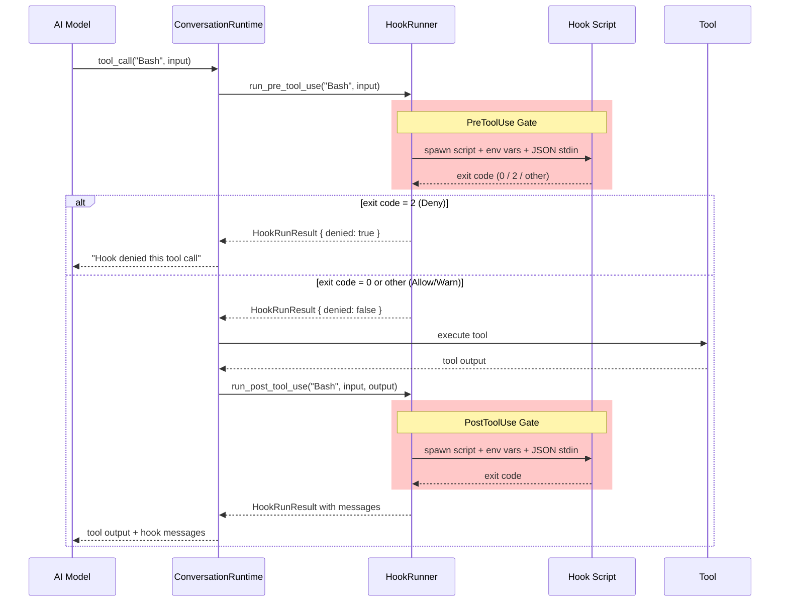
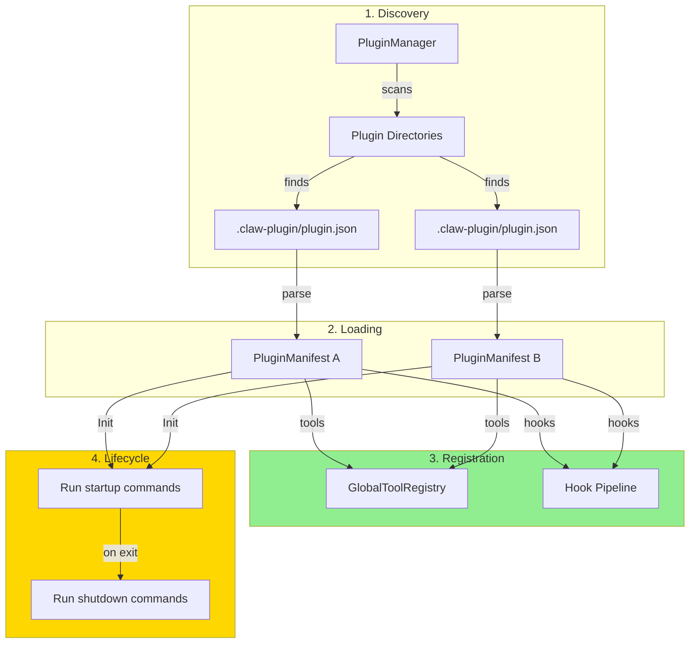
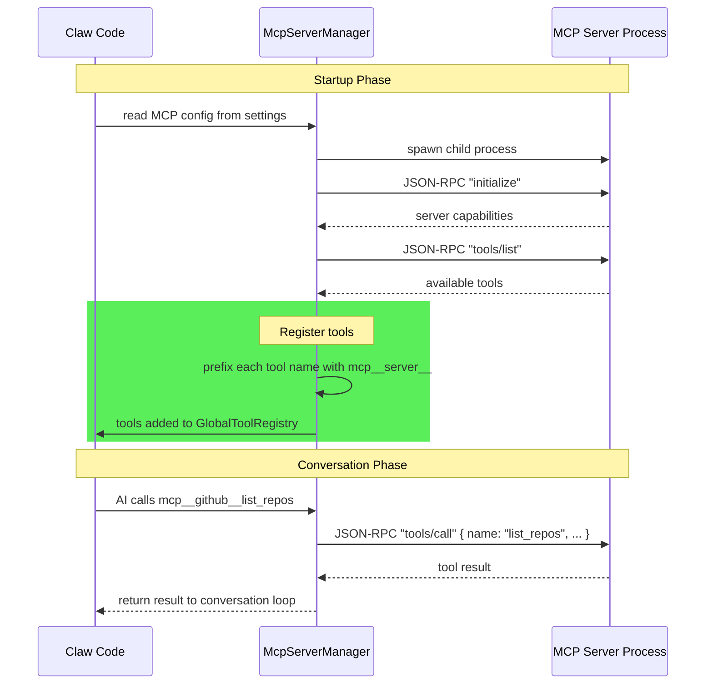
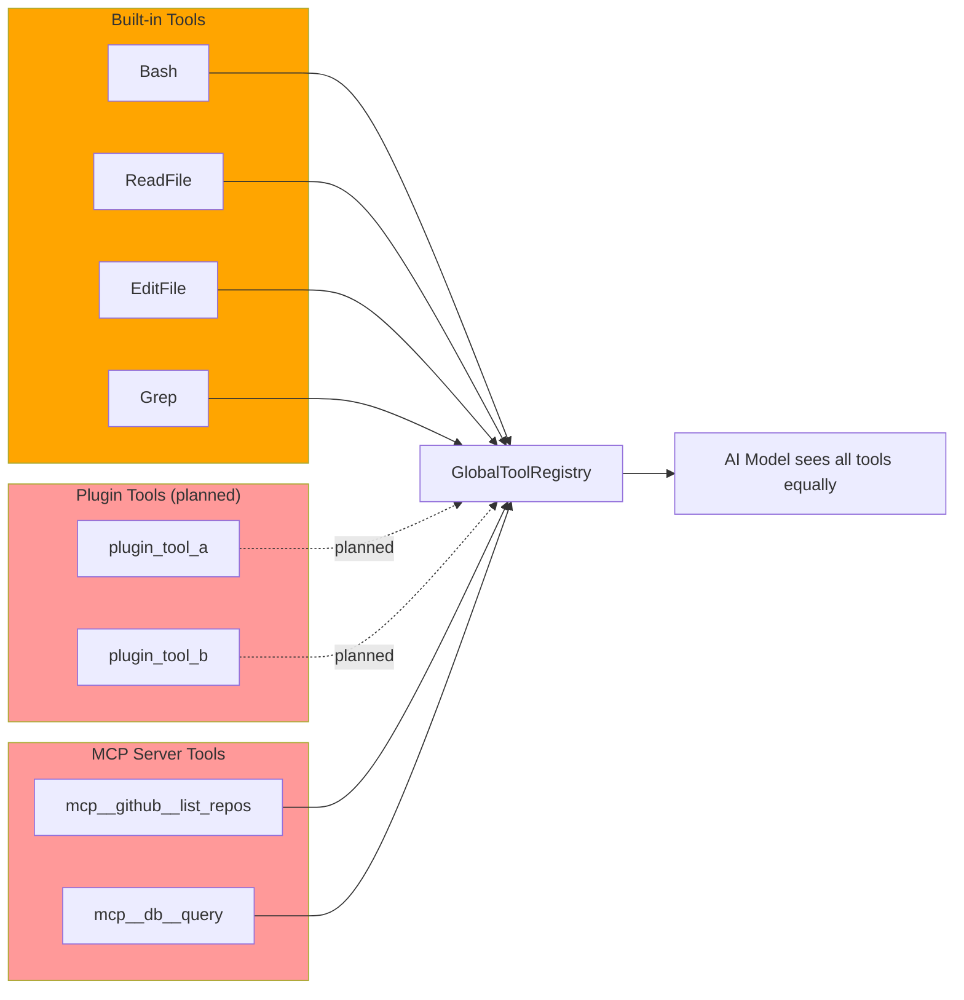

<script setup>
import Annotation from '../.vitepress/theme/Annotation.vue'
import SessionNav from '../.vitepress/theme/SessionNav.vue'
import SourceLink from '../.vitepress/theme/SourceLink.vue'
</script>

# Session 9: Extension Points -- Hooks, Plugins, and MCP

<div class="what-youll-learn">

**What You'll Learn**
- How hooks let you run custom scripts before or after any tool is used, and how they can block dangerous operations
- How the plugin system is structured to let external packages add tools, commands, and hooks (scaffolded, not yet runtime-complete)
- How MCP (Model Context Protocol) connects Claw Code to external tool servers over stdin/stdout, HTTP, and WebSockets
- How all three extension mechanisms feed into the same `GlobalToolRegistry` that built-in tools use

</div>

---

## Part 1: Hooks (Implemented)

### The Analogy

Imagine a school hallway with a security checkpoint at each door. Before you enter a classroom (use a tool), a guard checks your pass. If the pass is invalid, you're turned away. After you leave the classroom, another guard logs what you did. Hooks work the same way -- they're checkpoint scripts that run before and after every tool call.

### Two Hook Events

Claw Code supports exactly two hook events:

| Event | When It Fires | What It Can Do |
|-------|---------------|----------------|
| `PreToolUse` | **Before** the tool runs | Allow, deny, or warn |
| `PostToolUse` | **After** the tool runs | Flag the result, log it, or warn |

Here's the enum from <SourceLink file="rust/crates/runtime/src/hooks.rs" />:

```rust
pub enum HookEvent {
    PreToolUse,
    PostToolUse,
}
```

In plain English: every tool call passes through two gates. The first gate (`PreToolUse`) can slam shut and prevent the tool from running at all. The second gate (`PostToolUse`) inspects the result after the fact.

### The Core Types

```rust
pub struct HookRunner {
    config: RuntimeHookConfig,
}
```

`HookRunner` is the engine that executes hooks. It holds a `RuntimeHookConfig`, which is just two lists of shell commands -- one list for pre-tool hooks, one for post-tool hooks.

```rust
pub struct RuntimeHookConfig {
    pre_tool_use: Vec<String>,   // shell commands to run before a tool
    post_tool_use: Vec<String>,  // shell commands to run after a tool
}
```

Each entry in those vectors is a shell command (like `"my-check-script.sh"` or `"python3 validate.py"`). When a tool is about to run, Claw Code executes every command in the `pre_tool_use` list, one by one.

```rust
pub struct HookRunResult {
    denied: bool,
    messages: Vec<String>,
}
```

After all the hook commands finish, the result tells Claw Code two things: was the tool denied (`denied: true`), and were there any messages to show the user?

### How a Hook Command Executes

Here's the step-by-step process for each hook command:

1. **Spawn a shell process** -- On macOS/Linux it runs `sh -lc "your-command"`. On Windows it runs `cmd /C "your-command"`.

2. **Set environment variables** so the script knows what's happening:
   - `HOOK_EVENT` -- `"PreToolUse"` or `"PostToolUse"`
   - `HOOK_TOOL_NAME` -- which tool is being called (e.g., `"Bash"`, `"ReadFile"`)
   - `HOOK_TOOL_INPUT` -- the JSON input the tool received
   - `HOOK_TOOL_OUTPUT` -- the tool's output (only set for `PostToolUse`)
   - `HOOK_TOOL_IS_ERROR` -- `"1"` if the tool errored, `"0"` otherwise

3. **Send a JSON payload to stdin** with all the same information in a structured format:
   ```json
   {
     "hook_event_name": "PreToolUse",
     "tool_name": "Bash",
     "tool_input": { "command": "rm -rf /" },
     "tool_input_json": "{\"command\":\"rm -rf /\"}",
     "tool_output": null,
     "tool_result_is_error": false
   }
   ```

4. **Check the exit code** to decide what to do:

| Exit Code | Meaning | Behavior |
|-----------|---------|----------|
| `0` | Allow | Tool proceeds. Stdout becomes feedback to the AI. |
| `2` | Deny | Tool is **blocked**. The denial message is returned instead. |
| Any other | Warn | Tool proceeds anyway, but a warning is logged. |

This is the actual decision logic from the source code:

```rust
enum HookCommandOutcome {
    Allow { message: Option<String> },
    Deny { message: Option<String> },
    Warn { message: String },
}
```

### Hook Execution Sequence



### Configuring Hooks

Hooks are configured in `.claw/settings.json`:

```json
{
  "hooks": {
    "PreToolUse": ["my-check-script.sh"],
    "PostToolUse": ["my-log-script.sh"]
  }
}
```

You can have multiple commands per event. They run in order, and a `PreToolUse` hook that denies stops the chain immediately -- no further hooks run, and the tool never executes.

<Annotation type="warning">
Hook scripts run as shell subprocesses with access to environment variables containing tool inputs. Be careful with hooks that log or forward this data -- tool inputs may contain sensitive information like file contents or API keys.
</Annotation>

**Status: Implemented.** The `HookRunner` in <SourceLink file="rust/crates/runtime/src/hooks.rs" /> is fully functional with tests covering allow, deny, and warn scenarios.

---

## Part 2: Plugins (Scaffolded -- Not Runtime-Complete)

### The Analogy

Imagine a phone with an app store. Each app (plugin) comes with a description, a list of permissions it needs, and the actions it can perform. You install the app, and the phone integrates its features into your home screen. Claw Code's plugin system works the same way -- except right now, the "app store" catalog exists and apps can be described, but the phone doesn't actually run them yet.

### What a Plugin Contains

A plugin is an external package that can add:
- **Tools** -- new capabilities the AI can use
- **Commands** -- new slash commands for the REPL
- **Hooks** -- additional PreToolUse/PostToolUse scripts
- **Lifecycle events** -- Init (run on startup) and Shutdown (run on exit)

All of this is described in a manifest file at `.claw-plugin/plugin.json`.

### The Key Types

From <SourceLink file="rust/crates/plugins/src/lib.rs" />:

```rust
pub struct PluginMetadata {
    pub id: String,
    pub name: String,
    pub version: String,
    pub description: String,
    pub kind: PluginKind,         // Builtin, Bundled, or External
    pub source: String,
    pub default_enabled: bool,
    pub root: Option<PathBuf>,
}
```

`PluginMetadata` is the identity card for a plugin. The `kind` field tells you where it came from:

| Kind | Meaning |
|------|---------|
| `Builtin` | Ships inside Claw Code itself |
| `Bundled` | Packaged alongside Claw Code |
| `External` | Installed separately by the user |

The manifest describes everything the plugin provides:

```rust
pub struct PluginManifest {
    pub name: String,
    pub version: String,
    pub description: String,
    pub permissions: Vec<PluginPermission>,  // Read, Write, Execute
    pub hooks: PluginHooks,                  // PreToolUse, PostToolUse commands
    pub lifecycle: PluginLifecycle,           // Init, Shutdown commands
    pub tools: Vec<PluginToolManifest>,
    pub commands: Vec<PluginCommandManifest>,
}
```

Each tool a plugin provides is described by:

```rust
pub struct PluginToolManifest {
    pub name: String,
    pub description: String,
    pub input_schema: Value,              // JSON Schema for the tool's input
    pub command: String,                  // Shell command to run
    pub args: Vec<String>,
    pub required_permission: PluginToolPermission,  // ReadOnly, WorkspaceWrite, DangerFullAccess
}
```

In plain English: a plugin tool is a shell command with a name, a description (so the AI knows when to use it), and a permission level (so the user stays in control of what it can do).

### How Plugins Would Work (When Complete)



The planned flow:
1. **Discover** -- `PluginManager` scans known directories for installed plugins
2. **Load** -- Parse each plugin's `plugin.json` manifest
3. **Register** -- Add plugin tools to `GlobalToolRegistry`, merge plugin hooks into the hook pipeline
4. **Lifecycle** -- Run Init commands on startup, Shutdown commands on exit

**Status: Scaffolded.** Config parsing and manifest loading work. The `PluginManifest`, `PluginMetadata`, and related types are fully defined. However, there is no runtime discovery or execution pipeline yet -- plugins are not actually loaded or run during a session. The plugin crate is real Rust code that compiles and has tests, but it is not wired into the conversation loop.

<Annotation type="info">
The plugin permission model (`ReadOnly`, `WorkspaceWrite`, `DangerFullAccess`) mirrors the built-in tool permission levels from Session 5. This means plugins will integrate naturally with the existing permission system once runtime execution is implemented.
</Annotation>

---

## Part 3: MCP -- Model Context Protocol (Partially Implemented)

### The Analogy

Imagine you have a universal TV remote. Instead of building separate buttons for every brand of TV, the remote speaks a standard protocol that any TV manufacturer can support. MCP is that universal remote for AI tools. Instead of hard-coding every possible tool into Claw Code, MCP lets you connect to external "tool servers" that each speak the same protocol. A GitHub server provides GitHub tools, a database server provides database tools, and Claw Code talks to all of them the same way.

### Transport Types

MCP servers can communicate over several different transports:

```rust
pub enum McpClientTransport {
    Stdio(McpStdioTransport),       // Talk via stdin/stdout of a subprocess
    Sse(McpRemoteTransport),        // Server-Sent Events over HTTP
    Http(McpRemoteTransport),       // Plain HTTP requests
    WebSocket(McpRemoteTransport),  // WebSocket connection
    Sdk(McpSdkTransport),           // Named SDK server
    ManagedProxy(McpManagedProxyTransport),  // Claude.ai managed proxy
}
```

In plain English: transport is "how do we talk to the server?" The most common is `Stdio` -- Claw Code spawns the server as a child process and talks to it by writing to its stdin and reading from its stdout. This is simple and works locally without any network setup.

### MCP Tool Naming

When Claw Code discovers tools from an MCP server, it gives them a special prefixed name so they don't collide with built-in tools. The naming convention is:

```
mcp__<server_name>__<tool_name>
```

For example, if you configure a server called `"github"` and it provides a tool called `"list_repos"`, the tool is registered as `mcp__github__list_repos`.

The server name is normalized first -- spaces become underscores and special characters are removed. This logic lives in <SourceLink file="rust/crates/runtime/src/mcp.rs" />:

```rust
pub fn mcp_tool_name(server_name: &str, tool_name: &str) -> String {
    format!(
        "{}{}",
        mcp_tool_prefix(server_name),
        normalize_name_for_mcp(tool_name)
    )
}
```

### Configuring MCP Servers

MCP servers are declared in `.claw/settings.json`:

```json
{
  "mcpServers": {
    "github": {
      "command": "github-mcp-server",
      "args": ["--token", "$GITHUB_TOKEN"]
    },
    "database": {
      "type": "sse",
      "url": "http://localhost:8080/mcp"
    }
  }
}
```

Each server entry maps a name to its connection details. For stdio servers, you specify the `command` and `args`. For remote servers, you specify a `url` and optionally a transport `type`.

### How MCP Integration Works

The stdio transport implementation lives in <SourceLink file="rust/crates/runtime/src/mcp_stdio.rs" />. Here's how a tool call flows through the system:



Step by step:

1. **Read config** -- On startup, Claw Code reads MCP server definitions from settings
2. **Spawn server** -- For stdio servers, spawn the command as a child process
3. **Initialize** -- Send a JSON-RPC `"initialize"` request to negotiate capabilities
4. **Discover tools** -- Send `"tools/list"` to learn what tools the server provides
5. **Register tools** -- Add each discovered tool to the `GlobalToolRegistry` with the `mcp__` prefix
6. **Route calls** -- During the conversation, when the AI calls an MCP tool, the runtime routes the JSON-RPC `"tools/call"` request to the correct server process
7. **Return results** -- The server's response flows back through the conversation loop to the AI

### The JSON-RPC Layer

MCP uses JSON-RPC 2.0 for all communication. Here are the request and response types from `mcp_stdio.rs`:

```rust
pub struct JsonRpcRequest<T = JsonValue> {
    pub jsonrpc: String,       // always "2.0"
    pub id: JsonRpcId,         // unique request identifier
    pub method: String,        // e.g., "initialize", "tools/list", "tools/call"
    pub params: Option<T>,     // method-specific parameters
}

pub struct JsonRpcResponse<T = JsonValue> {
    pub jsonrpc: String,
    pub id: JsonRpcId,
    pub result: Option<T>,     // present on success
    pub error: Option<JsonRpcError>,  // present on failure
}
```

In plain English: every MCP message is a JSON object with a method name and an ID. The server replies with a matching ID so Claw Code knows which request the response belongs to. This is the same protocol that language servers (like rust-analyzer) use.

**Status: Partially implemented.** The stdio transport (`McpStdioProcess`) is functional -- it can spawn servers, initialize them, list tools, and call tools. The naming and config layers (`mcp.rs`, `mcp_client.rs`) are complete. Remote transports (SSE, HTTP, WebSocket) have types defined but are not fully wired for runtime use.

---

## How Everything Feeds Into the Tool Registry

All three extension mechanisms -- built-in tools, plugins, and MCP servers -- converge on the same `GlobalToolRegistry`. The AI doesn't know or care where a tool came from. It just sees a flat list of available tools.



The dashed arrows for plugin tools show that this path is planned but not yet active. MCP tools and built-in tools are both solid -- they work today.

<Annotation type="analogy">
Think of `GlobalToolRegistry` as a phone book. The AI looks up tools by name and doesn't care whether the listing is for a local business (built-in tool), a franchise (plugin tool), or an overseas office (MCP server tool). The phone book provides one unified interface to reach them all.
</Annotation>

---

<div class="key-takeaways">

**Key Takeaways**
- **Hooks are checkpoint scripts.** They run before (`PreToolUse`) and after (`PostToolUse`) every tool call. Exit code 0 allows, exit code 2 denies, anything else warns. They are fully implemented and tested.
- **Plugins describe external packages with a manifest.** The manifest can declare tools, commands, hooks, and lifecycle events. The data structures and config parsing are complete, but plugins are not discovered or executed at runtime yet.
- **MCP is a universal protocol for external tool servers.** Claw Code spawns or connects to MCP servers, discovers their tools via JSON-RPC, and registers them alongside built-in tools. The stdio transport is functional.
- **All extension points feed into the same GlobalToolRegistry.** The AI model sees one flat list of tools regardless of whether they are built-in, from a plugin, or from an MCP server.
- **The exit-code convention (0 = allow, 2 = deny) is the key hook design decision.** It makes hooks easy to write in any language -- just exit with the right code.

</div>

---

<SessionNav
  :current="9"
  :prev="{ text: 'Session 8: CLI & Rendering', link: '/architecture/session-08-cli-and-rendering' }"
  :next="{ text: 'Session 10: Testing Patterns', link: '/architecture/session-10-testing-patterns' }"
/>
