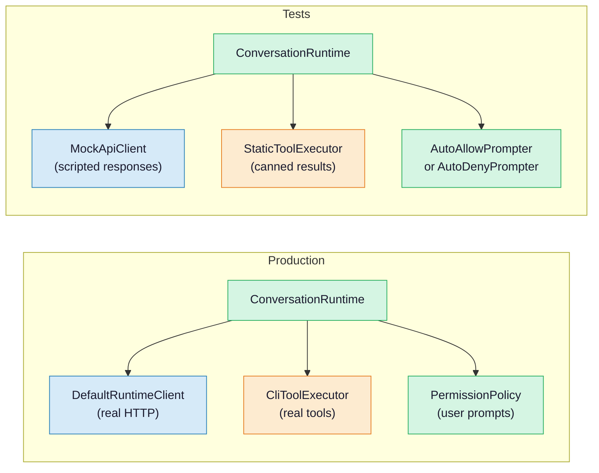
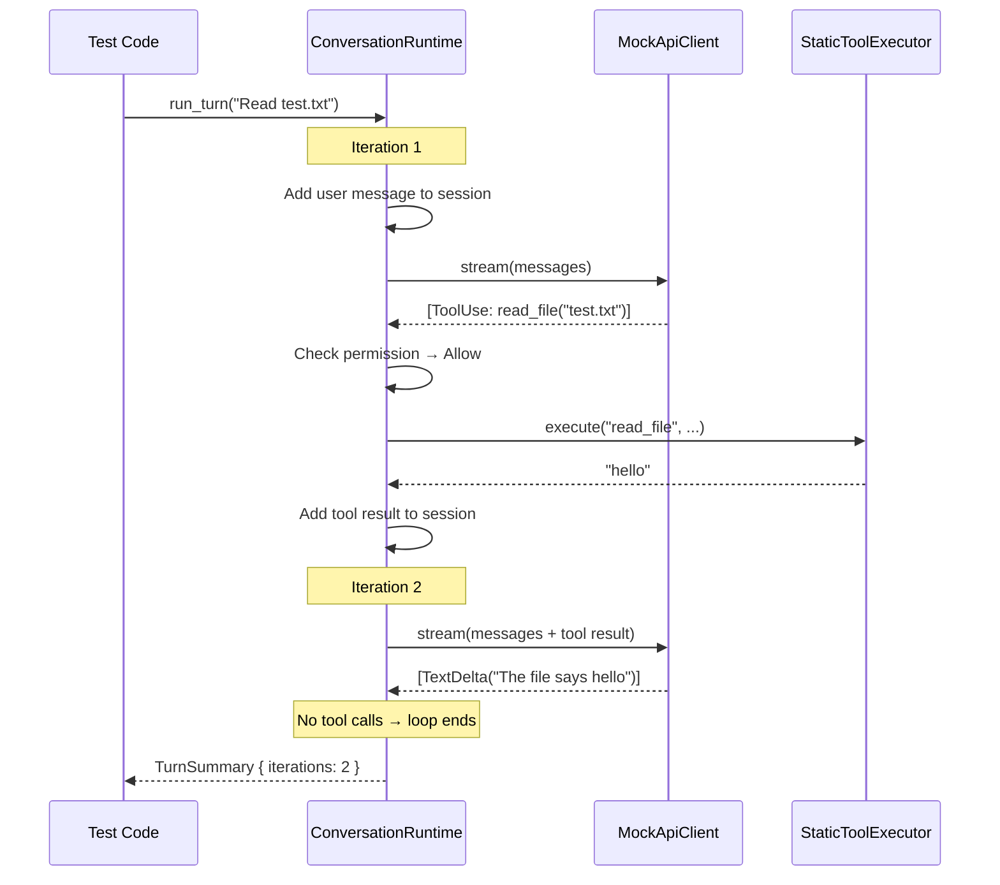

<script setup>
import Annotation from '../.vitepress/theme/Annotation.vue'
import SessionNav from '../.vitepress/theme/SessionNav.vue'
import WhyItWorks from '../.vitepress/theme/WhyItWorks.vue'
import Quiz from '../.vitepress/theme/Quiz.vue'
import SourceLink from '../.vitepress/theme/SourceLink.vue'
</script>

# Session 10: Testing Patterns

<div class="what-youll-learn">

**What You'll Learn**
- Why the trait-based design from Session 3 makes testing easy without changing any production code
- How to build mock versions of the API client, tool executor, and permission prompter
- How to write tests that verify the agentic loop handles text responses, tool calls, and permission denials correctly
- How snapshot testing on the `Session` struct catches regressions in conversation flow

</div>

---

## The Power of Trait-Based Design

### The Analogy

Imagine a play. The script stays the same every night -- the lines, the stage directions, the timing. But you can cast different actors. During rehearsal, you use understudies who follow the script perfectly and never improvise. You can test the entire play -- blocking, timing, scene transitions -- without needing the real stars. If the rehearsal goes well, you know the script works.

The `run_turn()` method in `ConversationRuntime` is that script. In production, it runs with real actors (a real HTTP client talking to Anthropic, a real tool executor running bash commands). In tests, it runs with understudies (mocks that return scripted responses). The **same code** runs in both cases.

### How This Works in Rust

In [Session 3](session-03-conversation-loop.md), we saw `ConversationRuntime` defined like this:

```rust
pub struct ConversationRuntime<C: ApiClient, T: ToolExecutor> {
    session: Session,
    api_client: C,
    tool_executor: T,
    permission_policy: PermissionPolicy,
    // ... other fields
}
```

The `<C: ApiClient, T: ToolExecutor>` part is the key. It says: "I'll work with **any** type, as long as it implements the `ApiClient` or `ToolExecutor` trait." A trait is like a contract -- it lists the methods a type must provide.

In **production**, the types are:

| Generic | Concrete Type | What it does |
|---------|---------------|-------------|
| `C` | `DefaultRuntimeClient` | Makes real HTTP requests to the Anthropic API |
| `T` | `CliToolExecutor` | Actually reads files, runs commands, searches code |

In **tests**, the types are:

| Generic | Concrete Type | What it does |
|---------|---------------|-------------|
| `C` | `MockApiClient` | Returns predetermined, scripted responses |
| `T` | `StaticToolExecutor` | Records calls and returns canned results |

The `run_turn()` code never changes. It calls `api_client.stream()` and `tool_executor.execute()` and doesn't care which implementation is behind them. This pattern is called **trait-based dependency injection**.

### Production vs Test Wiring



Both sides use the **exact same** `ConversationRuntime`. The green boxes are runtime code, the blue boxes are API code, and the orange boxes are tool code. The only difference is which concrete types fill the generic slots.

<Annotation type="analogy">
Trait-based dependency injection is like a universal power adapter. Your laptop (the runtime) works the same everywhere -- you just swap the adapter (mock vs real implementation) depending on whether you're in the US or Europe. The laptop doesn't change; only the plug does.
</Annotation>

<WhyItWorks technique="Trait-Based Testing">

#### The Everyday Analogy
<div class="analogy">
Imagine testing a fire alarm system. You don't want to start a real fire every time you test it! Instead, you use a smoke machine (a mock) that produces fake smoke. The alarm can't tell the difference — it responds exactly the same way. That's what mock implementations do: they simulate real behavior so you can test safely and cheaply.
</div>

#### What Would Go Wrong Without It
<div class="without-it">
Every test would need to call the real Anthropic API — costing real money, taking real time, and depending on network availability. Tests would be slow, expensive, and flaky. You couldn't test edge cases like "what if the API returns an error?" because you'd need the API to actually fail.
</div>

#### Fun Fact
<div class="fun-fact">
This testing approach is so effective that the industry has a name for it: "dependency inversion principle" — one of the five SOLID principles of software design coined by Robert C. Martin in the early 2000s. Rust makes it particularly elegant because traits are checked at compile time, so you can't accidentally pass the wrong mock.
</div>

</WhyItWorks>

---

## The Traits

The two traits that make this possible are simple contracts:

```rust
pub trait ApiClient {
    fn stream(&mut self, request: ApiRequest) -> Result<Vec<AssistantEvent>, RuntimeError>;
}

pub trait ToolExecutor {
    fn execute(&mut self, tool_name: &str, input: &str) -> Result<String, ToolError>;
}
```

In plain English:
- **ApiClient** says: "Give me a request, and I'll give you back a list of events (text, tool calls, etc.) or an error."
- **ToolExecutor** says: "Tell me which tool to run and what input to give it, and I'll give you back a string result or an error."

Any type that implements these methods can be plugged into `ConversationRuntime`. That's the whole trick.

---

## Building Mock Components

### MockApiClient

A mock API client holds a list of scripted responses. Each time `stream()` is called, it returns the next one in the list:

```rust
struct MockApiClient {
    responses: Vec<Vec<AssistantEvent>>,
    call_index: usize,
}

impl ApiClient for MockApiClient {
    fn stream(&mut self, _request: ApiRequest) -> Result<Vec<AssistantEvent>, RuntimeError> {
        let response = self.responses[self.call_index].clone();
        self.call_index += 1;
        Ok(response)
    }
}
```

Notice the `_request` parameter -- the underscore means "I receive this but I don't look at it." The mock doesn't care what you ask; it just plays back the next scripted response. First call returns `responses[0]`, second call returns `responses[1]`, and so on.

Think of it like a recording. You pre-record what the AI would say, and the mock plays it back in order.

### StaticToolExecutor

The codebase already provides a `StaticToolExecutor` (in <SourceLink file="rust/crates/runtime/src/conversation.rs" />). You register handlers by tool name, and each handler is a function that takes an input string and returns a result:

```rust
pub struct StaticToolExecutor {
    handlers: BTreeMap<String, ToolHandler>,
}
```

You set it up by registering tools:

```rust
let executor = StaticToolExecutor::new()
    .register("read_file", |input| Ok("file contents here".into()))
    .register("bash", |input| Ok("command output".into()));
```

When the runtime calls `executor.execute("read_file", ...)`, the `StaticToolExecutor` looks up `"read_file"` in its map and calls the registered handler. It never touches the real filesystem.

### MockPermissionPrompter

When the runtime needs to ask "Is this tool allowed?", it calls a `PermissionPrompter`. For tests, we can build simple ones:

**Auto-allow (say yes to everything):**

```rust
struct AutoAllowPrompter;

impl PermissionPrompter for AutoAllowPrompter {
    fn decide(&mut self, _tool: &str, _input: &str, _required: PermissionMode)
        -> PermissionOutcome
    {
        PermissionOutcome::Allow
    }
}
```

**Auto-deny (say no to everything):**

```rust
struct AutoDenyPrompter {
    reason: String,
}

impl PermissionPrompter for AutoDenyPrompter {
    fn decide(&mut self, _tool: &str, _input: &str, _required: PermissionMode)
        -> PermissionOutcome
    {
        PermissionOutcome::Deny { reason: self.reason.clone() }
    }
}
```

These are tiny -- just a few lines each. That's the beauty of traits: you only need to implement the methods in the contract, nothing more.

<Annotation type="tip">
When writing new tests, start with `AutoAllowPrompter` to test the happy path, then switch to `AutoDenyPrompter` to verify that permission denials are handled gracefully. This two-pass approach covers the most important permission scenarios with minimal test code.
</Annotation>

---

## Test Scenarios

Now let's see how these mocks come together to test the agentic loop from [Session 3](session-03-conversation-loop.md). Remember the flow: send messages to the AI, check for tool calls, run tools if needed, loop back.

### Scenario 1: Text-Only Response

**Goal:** Verify the loop stops when the AI responds with just text (no tool calls).

**Setup:**
1. Create a `MockApiClient` with one response: `[TextDelta("Hello!"), MessageStop]`
2. Create a `StaticToolExecutor` with no tools registered (empty)
3. Create a `ConversationRuntime` with these mocks
4. Call `run_turn("Hi")`

**What should happen:**
- The runtime sends the user message to the mock API client
- The mock returns a text-only response
- The runtime sees no tool calls, so the loop ends after one iteration
- `TurnSummary` shows `iterations == 1`, one assistant message, and zero tool results

This is the simplest possible test -- the "hello world" of agentic loop testing. If this breaks, nothing else will work.

### Scenario 2: One Tool Call

**Goal:** Verify the loop handles a single tool call and then stops.

**Setup:**
1. Create a `MockApiClient` with **two** responses:
   - Response 1: `[ToolUse { id: "1", name: "read_file", input: '{"path":"test.txt"}' }, MessageStop]`
   - Response 2: `[TextDelta("The file says hello"), MessageStop]`
2. Create a `StaticToolExecutor` with `read_file` registered, returning `"hello"`
3. Set the permission policy to `DangerFullAccess` (allow everything)
4. Call `run_turn("Read test.txt")`

**What should happen:**
- **Iteration 1:** The mock API returns a tool call. The runtime checks permissions (allowed), runs the tool via `StaticToolExecutor` (returns `"hello"`), adds the result to the session.
- **Iteration 2:** The mock API returns text only. No tool calls, so the loop ends.
- `TurnSummary` shows `iterations == 2`, one tool result, and final text `"The file says hello"`.

Here's the step-by-step sequence:



Notice how this diagram looks almost identical to the concrete example in [Session 3](session-03-conversation-loop.md). That's the whole point -- the loop behaves the same whether the components are real or mocked.

### Scenario 3: Permission Denied

**Goal:** Verify that denied tools produce error results, and the AI gets a chance to respond to the denial.

**Setup:**
1. Create a `MockApiClient` with **two** responses:
   - Response 1: `[ToolUse { id: "1", name: "bash", input: '{"command":"rm -rf /"}' }, MessageStop]`
   - Response 2: `[TextDelta("I can't run that command"), MessageStop]`
2. Set the permission policy to `ReadOnly` (bash requires `DangerFullAccess`)
3. Call `run_turn("Delete everything")`

**What should happen:**
- **Iteration 1:** The mock API returns a bash tool call. The runtime checks permissions -- denied. It creates an error tool result (`is_error: true`, output contains `"denied"`). No actual command runs.
- **Iteration 2:** The mock API sees the denial in the conversation history and responds with an explanation. No tool calls, loop ends.
- The key assertion: `tool_results[0].is_error == true` and the output contains the word `"denied"`.

This test verifies that the permission system from [Session 5](session-05-permissions.md) integrates correctly with the conversation loop. The AI doesn't crash or hang when a tool is denied -- it gets feedback and can adjust.

---

## Session Snapshot Testing

The `Session` struct stores the full conversation history. After running a test, you can inspect everything:

```rust
// After run_turn() completes:
let messages = &session.messages;

// Verify the exact message sequence
assert_eq!(messages[0].role, Role::User);
assert_eq!(messages[1].role, Role::Assistant);
assert_eq!(messages[2].role, Role::Tool);
assert_eq!(messages[3].role, Role::Assistant);

// Verify content block types
assert!(messages[1].blocks[0].is_tool_use());
assert!(messages[2].blocks[0].is_tool_result());
assert!(messages[3].blocks[0].is_text());

// Verify token counting
assert!(messages[1].usage.input_tokens > 0);
```

Imagine taking a photograph of the conversation at the end of each test. If someone changes `run_turn()` and the conversation structure changes, the snapshot test catches it immediately. You serialize the session to JSON, save it as a `.snap` file, and compare future test runs against it.

This is especially useful for catching subtle regressions -- cases where the code still "works" but the message ordering or content block structure has quietly changed.

<Annotation type="detail">
Snapshot files are typically checked into version control. When a legitimate behavior change alters the snapshot, you update the `.snap` file as part of the PR. Reviewers can then see exactly how the conversation structure changed, making regressions easy to spot in code review.
</Annotation>

---

## Putting It All Together

Here's a summary of how traits, mocks, and tests connect to everything you've learned:

| Session | Concept | Role in Testing |
|---------|---------|----------------|
| [Session 3](session-03-conversation-loop.md) | The agentic loop (`run_turn()`) | The code under test -- the script that never changes |
| [Session 4](session-04-tools-and-registry.md) | Tool registry and execution | `StaticToolExecutor` replaces real tools with canned responses |
| [Session 5](session-05-permissions.md) | Permission checks | `AutoAllowPrompter` / `AutoDenyPrompter` replace user prompts |
| [Session 7](session-07-streaming.md) | Streaming API events | `MockApiClient` returns pre-built event lists instead of HTTP streams |

The same architecture that makes Claw Code modular also makes it testable. Each component has a trait boundary, and every trait boundary is a place where you can swap in a mock.

---

<div class="key-takeaways">

**Key Takeaways**
- **Trait-based dependency injection** means `ConversationRuntime` works with real components OR test mocks -- the same `run_turn()` code runs in both cases
- **Mocks are simple.** A `MockApiClient` is just a list of scripted responses. A `StaticToolExecutor` is just a map of tool name to handler function. A mock prompter is a one-line "always allow" or "always deny."
- **Test scenarios mirror real usage.** The three scenarios (text-only, one tool call, permission denied) cover the three main paths through the agentic loop from [Session 3](session-03-conversation-loop.md)
- **Session snapshots** let you verify the exact sequence of messages and content blocks, catching subtle regressions that functional tests might miss
- **Every trait boundary is a test seam.** Wherever you see a generic parameter like `<C: ApiClient>`, that's a place where a mock can be plugged in

</div>

---

## Congratulations!

You've made it through all ten sessions of the Claw Code Architecture Guide. Here's what you now understand:

1. **The big picture** -- how a user's question flows through the system and back ([Session 1](session-01-big-picture.md))
2. **The crate map** -- the nine Rust crates and how they depend on each other ([Session 2](session-02-crate-map.md))
3. **The conversation loop** -- the agentic loop that is the heart of the system ([Session 3](session-03-conversation-loop.md))
4. **Tools and permissions** -- what the AI can do and what controls it ([Sessions 4](session-04-tools-and-registry.md) and [5](session-05-permissions.md))
5. **Config, prompts, and streaming** -- how the system is configured and how data flows ([Sessions 6](session-06-config-and-prompts.md) and [7](session-07-streaming.md))
6. **The CLI and extensions** -- the user-facing interface and how to extend it ([Sessions 8](session-08-cli-and-rendering.md) and [9](session-09-hooks-plugins-mcp.md))
7. **Testing patterns** -- how trait-based design makes the whole system testable without changing a line of production code (this session)

You now have a mental map of the entire codebase. When you read the source code, you'll know where to look, what each piece does, and how they fit together. That's a real superpower.

Welcome to the project.

<Quiz
  question="Why can ConversationRuntime use both a real API client and a mock API client?"
  :options="['It checks which one to use at runtime with an if statement', 'It uses generic type parameters — any type that implements the ApiClient trait works', 'It has two different run_turn() methods', 'The mock inherits from the real client']"
  :correct="1"
  explanation="ConversationRuntime<C: ApiClient, T: ToolExecutor> uses generic type parameters. The C can be ANY type that implements the ApiClient trait. In production that's DefaultRuntimeClient (real HTTP). In tests that's MockApiClient (scripted responses). Same run_turn() code, different wiring."
/>

---

<SessionNav
  :current="10"
  :prev="{ text: 'Session 9: Hooks, Plugins, MCP', link: '/architecture/session-09-hooks-plugins-mcp' }"
/>
